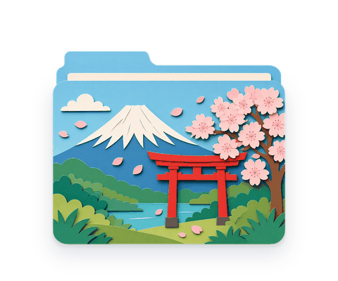
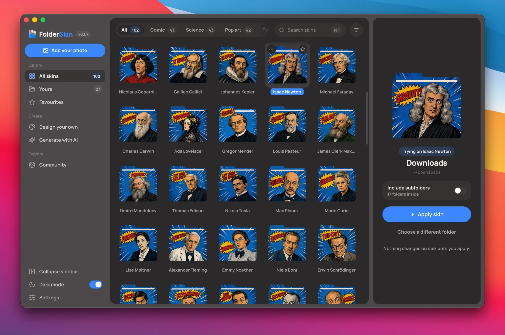
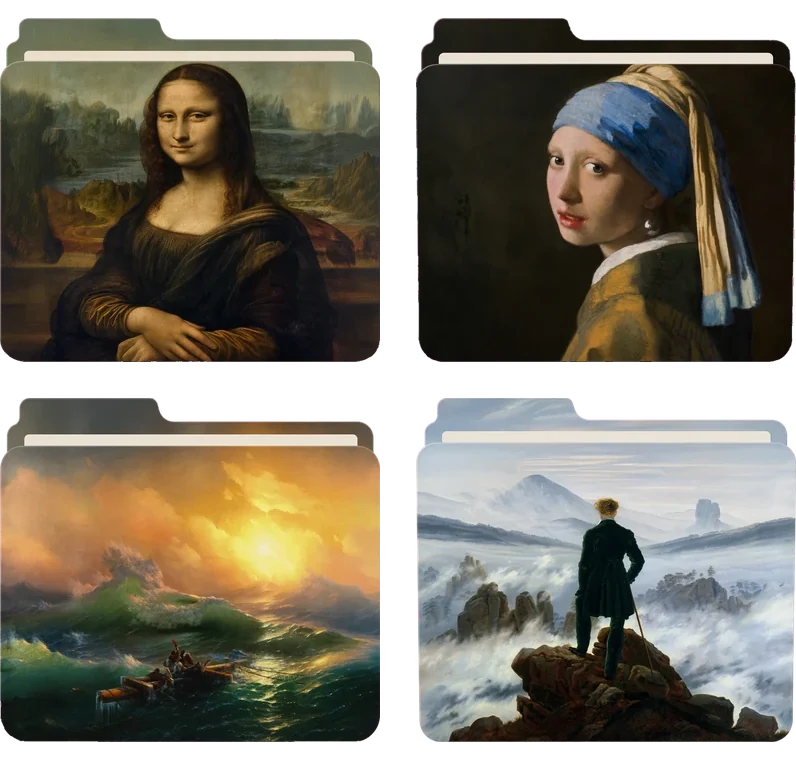
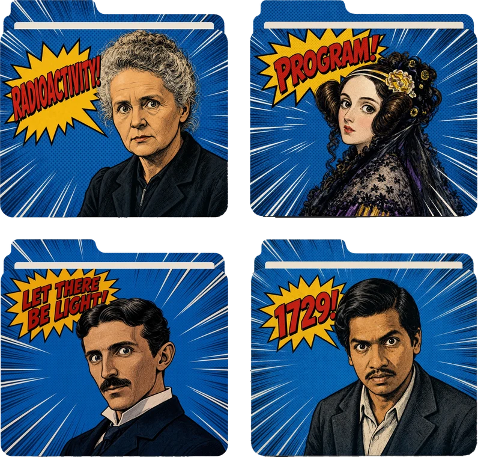

<div align="center">


# FolderSkin

[English](README.md) · [简体中文](README.zh-CN.md) · [日本語](README.ja.md) · 한국어 · [Français](README.fr.md) · [Español](README.es.md)

[](https://github.com/prajwal-svm/folderskin/releases/latest)
[](https://github.com/prajwal-svm/folderskin/releases/latest)
[](https://github.com/prajwal-svm/folderskin/releases/latest)

[](https://github.com/prajwal-svm/folderskin/actions/workflows/ci.yml) <!-- SonarQube Cloud badges, hidden until the project exists there (docs/CI.md): [](https://sonarcloud.io/summary/new_code?id=prajwal-svm_folderskin) [](https://sonarcloud.io/component_measures?id=prajwal-svm_folderskin&metric=coverage) --> [](https://github.com/prajwal-svm/folderskin/releases) [](CHANGELOG.md) [](https://github.com/prajwal-svm/folderskin/commits/main) [](LICENSE) [](https://tauri.app) [](https://github.com/prajwal-svm/folderskin-community) [](https://github.com/prajwal-svm/folderskin)

**어떤 폴더에든 스킨을 입혀 보세요.**

<picture>
  <source media="(prefers-color-scheme: dark)" srcset="docs/images/folder-cycle-dark.gif" />
  
</picture>

가장 소중한 추억도 오래된 서류와 똑같이 밋밋한 폴더에 들어 있어요. FolderSkin은 모든 폴더에 안에 든 것과 어울리는 스킨을 입혀 줘요. 여름 사진에는 골든 아워의 영화 스틸을, 여행에는 빈티지 여행 포스터를, 영상 프로젝트에는 팝 아트를, 생일에는 부드러운 파스텔을요. 폴더를 창에 끌어다 놓고, 스킨을 미리 입혀 보고, 마음에 드는 걸 적용하면 끝이에요. 무료 커뮤니티 팩에서 고르거나, 내 사진을 쓰거나, 색이나 단어, 이모지로 직접 디자인할 수 있고, 원하는 스타일을 설명해서 AI에게 그려 달라고 할 수도 있어요.

<p>
  <a href="https://github.com/prajwal-svm/folderskin/releases/latest"><strong>무료 다운로드</strong></a>
  · <a href="https://folderskin.app/ko/">folderskin.app</a>
  · <a href="https://folderskin.app/ko/community/">커뮤니티 팩</a>
  · <a href="docs/ko/PACKS.md">스킨 팩 공유하기</a>
  · <a href="#소스에서-빌드하기">소스에서 빌드하기</a>
  · <a href="https://github.com/prajwal-svm/folderskin">⭐ GitHub에서 스타 주기</a>
</p>

무료 · 오픈 소스 · 계정 불필요 · 추적 없음

</div>

<div align="center">
  
</div>

<details><summary>다크 모드</summary>



</details>

## 시작하기

| 이런 걸 하고 싶다면 | 이렇게 하세요 |
| --- | --- |
| 첫 스킨 받기 | 처음 실행하면 커뮤니티 팩을 보여 주고, Classic Art가 미리 선택되어 있어요 |
| 폴더를 새롭게 꾸미기 | 폴더를 창에 끌어다 놓고, 스킨을 클릭한 다음 **스킨 적용**을 누르세요 |
| 안에 있는 폴더도 함께 꾸미기 | 폴더 아래의 **하위 폴더 포함**을 켜고, **폴더 N개에 적용**을 누르세요 |
| 내 사진 쓰기 | 이미지를 창에 끌어다 놓거나 **사진 추가**를 누르세요 |
| 직접 디자인하기 | **직접 디자인**을 열고 색, 라벨, 이모지, 사진 중 하나로 시작해 원하는 대로 바꾼 다음 **저장 후 적용**을 누르세요 |
| AI에게 그려 달라고 하기 | **AI로 생성**을 열고 내 API 키를 쓰거나, **API 키가 없다면**에 있는 Grok이나 ChatGPT 채팅용 프롬프트를 쓰세요 |
| 다른 사람이 만든 스킨 받기 | **커뮤니티**에서 팩을 추가하세요 |
| 내 스킨 공유하기 | 스킨의 ⋯ 메뉴 → **커뮤니티에 공유** |
| 스킨 다시 찾기 | 위쪽의 태그, ⌘F / Ctrl+F, 필터 버튼(색, 팩, 추가한 시기 등), 또는 **즐겨찾기** 별표 |
| 원래대로 되돌리기 | **되돌리기**를 누르거나, 이미 사용자 지정 아이콘이 있는 폴더라면 **사용자 지정 아이콘 제거**를 누르면 운영체제 기본 아이콘으로 돌아가요 |

## 내 컴퓨터에 남는 것

인터넷이 꼭 필요한 몇 가지를 빼면 전부예요. 계정도, 유료 기능도, 사용자를 추적하는 것도 없어요. FolderSkin이 밖으로 알리는 건 커뮤니티 팩이 추가됐다는 사실 하나뿐이고, 그것도 팩 ID만 보내요. folderskin.app에서 팩마다 몇 번 추가됐는지 보여 주기 위해서예요. Mac 버전은 다운로드 크기가 20MB 미만이에요.

| 내 컴퓨터에 남는 것 | 온라인으로 나가는 것 |
| --- | --- |
| 폴더, 그리고 FolderSkin이 쓰는 아이콘 | AI 요청(요청할 때만). 내가 고른 제공업체에 내 키로 보내요 |
| 추가한 모든 이미지와 만든 모든 스킨 | 커뮤니티와 첫 실행. packs.folderskin.app에서 공유된 팩을 읽고, 연결되지 않으면 GitHub에서 읽어요 |
| 암호화된 AI 키 | 업데이트 확인. 앱이 열릴 때 FolderSkin이 GitHub에서 최신 릴리스의 버전 파일을 읽어요 |
| 즐겨찾기, 태그, 설정 | 커뮤니티에서 팩 추가. 팩 ID만 FolderSkin의 커뮤니티 서비스로 가고, 서비스는 네트워크마다 하루 한 번만 추가를 세며 주소는 보관하지 않아요([자세히](docs/ko/PACKS.md#설치-수)) |

FolderSkin이 무엇을 어디로 보내는지, 커뮤니티 서비스가 무엇을 보관하는지는 [개인정보 처리방침](https://folderskin.app/ko/privacy/)에 모두 나와 있어요.

## 사용 방법

FolderSkin을 처음 열면 짧은 환영 화면이 나온 뒤 커뮤니티 스킨 팩을 보여 줘요. Classic Art는 미리 선택되어 있어요. 원하는 만큼 추가해도 되고, 하나도 추가하지 않아도 돼요. 팩은 통째로 추가되거나 아예 추가되지 않고, 라이브러리는 나중에 언제든 **커뮤니티**에서 채울 수 있어요. 환영 화면은 다시 나오지 않아요.

<details><summary>첫 실행</summary>


</details>

1. 폴더를 오른쪽 폴더 패널로 끌어오거나, 빈 폴더를 클릭해서 고르세요.
2. 라이브러리에서 스킨을 클릭하면 미리 입혀 볼 수 있어요. 결과는 폴더 패널에 바로 보여요. 사이드바에서 **모든 스킨**, **내 스킨**, **즐겨찾기** 중 하나를 고르고, 위쪽의 태그로 범위를 좁히고, ⌘F / Ctrl+F로 검색할 수 있어요.
3. **스킨 적용**을 누르세요. 폴더에 **적용됨** 표시가 붙고, **Finder에서 보기**를 누르면 폴더가 열려요.
4. **되돌리기**를 누르면 운영체제 기본 아이콘으로 돌아가요. 이미 사용자 지정 아이콘이 있는 폴더를 고르면 바로 **사용자 지정 아이콘 제거**가 나타나요.

안에 있는 폴더에도 같은 스킨을 입히려면, 폴더 이름 아래의 **하위 폴더 포함**을 켜세요. 폴더가 몇 개든 백그라운드에서 세고(아래 모든 단계까지 세지만 숨김 폴더, 앱 번들, 다른 디스크는 빼요), 버튼이 **폴더 25개에 적용**처럼 실제 개수에 맞게 바뀌어요. **선택**으로 어느 폴더에 입힐지 고를 수 있어요. 10개가 넘으면 시작하기 전에 물어보고, 아주 많으면 아이콘이 차지할 공간도 알려 줘요. 작업은 백그라운드에서 이어지니 그동안 다른 폴더를 고르거나 앱의 다른 화면을 써도 돼요. 폴더 패널과 사이드바 아래쪽에 얼마나 진행됐는지 보이고, **중지**를 누르면 지금 처리 중인 폴더까지만 하고 멈춰요. 마지막 요약에서는 무엇이 바뀌었는지, 어떤 폴더를 바꾸지 못했고 그 이유는 무엇인지 알려 주고, 이어서 진행하거나 실패한 폴더를 다시 시도할 수 있어요. FolderSkin이 앞에 나와 있지 않으면 끝났을 때 알림으로 알려 줘요. **모두 되돌리기**는 그 실행에서 입힌 것만 정확히 벗겨 내요.

내 이미지를 쓰려면 창에 끌어다 놓거나 **사진 추가**를 누르세요. 이미지는 **내 스킨**에 저장되고, 지울 때까지 남아 있어요(지우기 전에 한 번 물어봐요). 아래에 나오는 채팅 프롬프트로 만든 것처럼 단색 마젠타 배경 위에 그린 완성된 폴더는 잘라 내서 그대로 써요. 그 밖의 이미지는 FolderSkin 폴더에 씌워요.

추가한 스킨에는 모두 ⋯ 메뉴가 있어요. 이름 바꾸기(이름을 더블클릭하거나 F2를 누르면 바로 바꿀 수 있어요), 태그 붙이기(태그는 위쪽의 필터가 돼요), 만든 방법 보기(AI 모델과 프롬프트, 또는 팩과 공유한 사람), 공유, 삭제를 할 수 있어요. AI로 만든 결과에는 도착하는 대로 `airbrush` 같은 스타일 태그가 붙어요.

사이드바 아래쪽의 **설정**에서는 테마, AI 키, 공유할 때 자동으로 채워지는 정보, 스킨을 저장하는 위치를 정할 수 있어요. 로고 옆의 버전 배지에 마우스를 올리면 앱 정보가 나와요.

## 커뮤니티 스킨

<table>
  <tr>
    <td align="center"><a href="https://folderskin.app/ko/community/?pack=classic-art-5rxas2"><br /><b>Classic Art</b></a></td>
    <td align="center"><a href="https://folderskin.app/ko/community/?pack=scientists-pop-art-nb3dfx"><br /><b>Scientists - Pop Art</b></a></td>
  </tr>
  <tr>
    <td align="center"><a href="https://folderskin.app/ko/community/?pack=watercolour-world-rt2klu"><br /><b>Watercolour World</b></a></td>
    <td align="center"><a href="https://folderskin.app/ko/community/?pack=countries-in-paper-lhadao"><br /><b>Countries in Paper</b></a></td>
  </tr>
</table>

FolderSkin에는 기본으로 들어 있는 스킨이 없어요. 스킨과 스킨 팩은 사람들이 FolderSkin을 통해 공유하고, 누구나 무료로 쓸 수 있어요. 첫 실행 때 보여 주고, **커뮤니티**에서 언제든 받을 수 있어요. 팩을 추가하면 스킨이 태그와 함께 라이브러리에 들어가고, [folderskin.app](https://folderskin.app/ko/community/) 갤러리에서 팩의 **설치** 버튼을 누르면 FolderSkin이 열리면서 팩을 추가해 줘요. **공식** 표시가 붙은 팩은 메인테이너가 보증하는 팩이에요. 첫 팩으로는 **Classic Art**를 추천해요. 모나리자부터 별이 빛나는 밤까지, 퍼블릭 도메인 명화 16점을 하나하나 폴더에 그려 넣은 팩이에요. 내 스킨을 공유하려면 스킨의 ⋯ 메뉴에서 **커뮤니티에 공유**를 고르고, 여러 개라면 **커뮤니티 → 스킨 공유**를 쓰세요. 계정 없이 브라우저에서 컴퓨터를 한 번만 인증하면 되고, 팩은 사람이 검토한 다음 커뮤니티에 올라가 모두가 볼 수 있어요. 같은 대화상자의 **폴더로 저장**을 쓰면 팩을 보내는 대신 파일로 저장해요. 이미지는 무손실로 공유되기 때문에 팩은 만든 그대로 보여요. 규격과 제한은 [docs/ko/PACKS.md](docs/ko/PACKS.md)에 있어요. 팩 하나에 스킨은 1개부터 50개까지, 이미지는 한 장에 1024px, 1.5MB까지, 팩 전체는 64MB까지이고, 라이선스는 CC0, CC BY 4.0, MIT 중 하나예요.

## 직접 디자인

사이드바의 **직접 디자인**에서는 오프라인으로 스킨을 처음부터 만들 수 있어요. 단색, 라벨, 이모지, 투톤, 유리, 스트라이프, 캡션이 있는 사진 중 하나로 시작해서 모든 걸 바꿀 수 있어요.

- 어떤 색이든, 어떤 투명도든, 그리고 그라데이션
- 17가지 글꼴 스타일의 글자(아치 모양으로 휘게 할 수도 있어요)
- 이모지, 도형 13가지, 필름 그레인까지 갖춘 패턴 10가지
- 보정 기능이 있는 내 이미지
- 그림자, 글로우, 스티커 테두리

**폴더 뼈대** 스위치로 디자인을 폴더에 입힌 모습과 평면 모습을 오가며 볼 수 있고, 옆에는 Finder가 그리는 크기의 아이콘이 있어서 실제로 어떻게 보일지 알 수 있어요. 비치는 유리 폴더를 만들 수도 있고, **자유형 아이콘**을 골라 폴더와 전혀 다른 모양의 스티커를 만들 수도 있어요. **저장 후 적용**을 누르면 폴더에 입혀지고, ⋯ 메뉴의 **디자인 편집**으로 다시 열 수 있어요. 자세한 내용은 [docs/ko/COMPOSER.md](docs/ko/COMPOSER.md)에 있어요.

<details><summary>디자이너</summary>


</details>

## AI로 스킨 생성하기

FolderSkin은 설명만으로 스킨을 만들 수 있어요. **로컬 모델**은 내 컴퓨터에서 무료로 그려요. 한 번만 설정하면 키가 필요 없고, 아무 데도 아무것도 보내지 않아요. macOS 14 이상의 Apple 실리콘 Mac과 Windows, Linux PC에서 돌아가요. 이미 쓰고 있는 제공업체의 **내 API 키**를 써도 돼요. 키는 암호화되어 내 컴퓨터에 저장되고(키체인 비밀번호를 묻는 창도 뜨지 않아요), FolderSkin에는 자체 서버가 없으며, Enter를 누르기 전까지는 아무것도 보내지 않아요. **AI로 생성**을 열고 장면을 설명한 다음 스타일을 고르고, **폴더 전체**(모델이 FolderSkin의 템플릿을 바탕으로 포스터처럼 폴더 전체를 그려요)나 **그림만**(평면 그림을 FolderSkin 폴더에 씌워요)을 고르세요. 모든 결과는 **내 스킨**에 저장되고 바로 미리 입혀 볼 수 있어요.

그림을 어디서 만들지는 **설정 → AI 제공업체**에서 골라요. 거기서 로컬 모델을 설정하거나 키를 붙여 넣으세요. 각 제공업체 이름은 키를 만드는 페이지로 연결돼요.

| | 제공업체 | 모델 | 이미지당 |
| :-: | --- | --- | --- |
| <picture><source media="(prefers-color-scheme: dark)" srcset="docs/images/providers/openai-dark.svg"></picture> | [OpenAI](https://platform.openai.com/api-keys) | GPT Image 2.5 Flare, GPT Image 2.5 Sunburst, GPT Image 1 | 약 $0.02~0.19 |
| <picture><source media="(prefers-color-scheme: dark)" srcset="docs/images/providers/xai-dark.svg"></picture> | [xAI Grok](https://console.x.ai) | Grok Imagine | 약 $0.02 |
| <picture><source media="(prefers-color-scheme: dark)" srcset="docs/images/providers/recraft-dark.svg"></picture> | [Recraft](https://www.recraft.ai/profile/api) | Recraft V3 | 약 $0.04 |
|  | [Google Gemini](https://aistudio.google.com/apikey) | Gemini 3.1 Flash Image | 약 $0.07 |
| <picture><source media="(prefers-color-scheme: dark)" srcset="docs/images/providers/bfl-dark.svg"></picture> | [Black Forest Labs](https://dashboard.bfl.ai) | FLUX 1.1 Pro | 약 $0.04 |
|  | [Stability AI](https://platform.stability.ai/account/keys) | Stable Image Core | 약 3크레딧 |
| <picture><source media="(prefers-color-scheme: dark)" srcset="docs/images/providers/ideogram-dark.svg"></picture> | [Ideogram](https://ideogram.ai/manage-api) | Ideogram v3 | 약 $0.03~0.09 |

키가 없나요? [docs/ko/PROMPTS.md](docs/ko/PROMPTS.md)에 Grok이나 ChatGPT 채팅에서 쓸 수 있는 템플릿과 프롬프트가 있어요. 앱에서도 **API 키가 없다면**을 열면 같은 프롬프트가 채워진 채로 나와요.

[docs/ko/AI.md](docs/ko/AI.md)에서는 제공업체, 키가 저장되는 곳, 알파 채널을 돌려주지 못하는 모델에서 투명도를 처리하는 방법, 각 오류 메시지의 뜻을 설명해요.

## 팩 만들기

이미지 모델로 렌더링한 3D 폴더처럼 주제가 있는 세트는 명령 한 번으로 커뮤니티 팩이 돼요. 팩은 별도의 저장소인 [folderskin-community](https://github.com/prajwal-svm/folderskin-community)에 있으니, 이 저장소 옆에 체크아웃하세요. `folderskin-tools packs make`는 완성된 폴더를 마젠타 배경에서 잘라 내고(분홍빛으로 틀어진 배경이나 무늬 없는 회색처럼 다른 단색 배경에는 `--flat-backdrop`을 써요), 모든 이미지를 제한에 맞게 줄이고 압축하고, 완성된 폴더를 한 가지 모양으로 맞춘 다음 `pack.json`을 만들어요.

```sh
cargo run -p folderskin-tools -- packs make ~/Pictures/renders --dir ../folderskin-community \
  --name "3D Folders" --tags 3d,glossy --author your-github-name \
  --preview /tmp/3d-folders.png
cargo run -p folderskin-tools -- packs check --dir ../folderskin-community
```

`render`는 어떤 이미지든 그 이미지로 만들어지는 폴더를 미리 보여 주고, `guide`는 폴더에 씌울 아트워크를 위해 템플릿의 안전 영역을 그려 줘요. 팩 규격과 팩을 제안하는 방법은 [docs/ko/PACKS.md](docs/ko/PACKS.md)에, 이미지가 아이콘이 되는 방식은 [docs/ko/SKINS.md](docs/ko/SKINS.md)에 있어요. [.claude/skills/folderskin-skins/SKILL.md](.claude/skills/folderskin-skins/SKILL.md)는 Claude Code에게 전체 과정을 가르쳐 주기 때문에, "이 렌더링으로 팩을 만들어 줘"라고 부탁하기만 하면 돼요.

## 작동 원리

Rust 코어(`crates/folderskin-core`)는 폴더 템플릿을 벡터 경로로 갖고 있고, 이미지를 뒷면 패널과 앞면 패널에 커버 핏으로 맞춰 넣고, `tiny-skia`로 전체를 2048px로 한 번 렌더링한 다음, Lanczos3로 모든 아이콘 크기에 맞게 줄여요. 웹뷰는 폴더 모양을 직접 그리지 않고 코어가 렌더링한 PNG만 보여 줘요. 그래서 갤러리 썸네일, 미리 보기, 디스크에 저장된 아이콘이 모든 플랫폼에서 똑같은 픽셀이에요. 자세한 내용은 [docs/ARCHITECTURE.md](docs/ARCHITECTURE.md)에 있어요.

## 플랫폼별 참고 사항

| OS | 방식 | 폴더 안에 쓰는 파일 | 주의할 점 |
|---|---|---|---|
| macOS | `NSWorkspace.setIcon` | macOS가 관리하는 보이지 않는 `Icon\r` 파일 | 없음. Finder에 바로 반영돼요 |
| Windows | `desktop.ini` + `folderskin-<hash>.ico`(둘 다 숨김 및 시스템 속성). 폴더를 읽기 전용으로 표시한 뒤 폴더와 상위 폴더에 `SHChangeNotify`를 보내요 | `desktop.ini`, `folderskin-<hash>.ico` | 없음. 적용이 끝나면 폴더가 다시 그려져요 |
| Linux | KDE용 `.directory`, 그리고 Nautilus, Nemo, Caja용 `gio set metadata::custom-icon` | `.directory`, `.folderskin.png` | 일부 타일링 파일 관리자나 최소 구성 파일 관리자는 둘 다 읽지 않아요 |

되돌리기는 FolderSkin이 쓴 것만 지우고, 두 번 실행해도 안전해요. 클라우드로 동기화되는 폴더(iCloud, OneDrive, Dropbox)는 보조 파일도 다른 컴퓨터로 동기화해요. 직접 되돌리는 방법을 포함한 전체 내용은 [docs/PLATFORMS.md](docs/PLATFORMS.md)에 있어요.

## 다운로드

무료 · 오픈 소스 · 계정 불필요 · 추적 없음

| 플랫폼 | 패키지 | 다운로드 |
| --- | --- | --- |
| macOS 12 이상 · Apple 실리콘 및 Intel | 유니버설 DMG | [](https://github.com/prajwal-svm/folderskin/releases/latest) |
| Windows 10, 11 · x86_64 | `-setup.exe` 또는 MSI | [](https://github.com/prajwal-svm/folderskin/releases/latest) |
| Linux · x86_64 | AppImage, DEB, RPM | [](https://github.com/prajwal-svm/folderskin/releases/latest) |
| Linux · ARM64 | AppImage, DEB, RPM | [](https://github.com/prajwal-svm/folderskin/releases/latest) |

macOS 앱은 Apple의 서명과 공증을 받았기 때문에 다른 앱처럼 그냥 열려요. Windows 설치 프로그램은 아직 서명되지 않아서 SmartScreen이 먼저 확인해요. "추가 정보"를 누른 다음 "실행"을 누르세요. Linux 패키지에는 glibc 2.35 이상이 필요해요(Ubuntu 22.04, Debian 12, Fedora 36 이상).

설치한 뒤에는 FolderSkin이 알아서 최신 상태를 유지해요. 새 버전이 나오면 바뀐 내용을 보여 주고, **업데이트 후 다시 시작**을 누르면 설치돼요. 모든 업데이트에는 서명이 있고, 앱은 무엇이든 설치하기 전에 서명을 확인해요.

### 명령줄

`folderskin`을 쓰면 앱에서 하는 일을 터미널에서 할 수 있어요. 한꺼번에 처리하거나 드라이브 전체를 바꿀 때 편해요. 폴더에 그림을 입히거나 되돌리고, 로컬 모델이나 내 키로 폴더 그림을 그리고, 팩을 만들 수 있어요. Mac이나 Linux에서는 다음을 실행하세요.

```sh
curl -fsSL https://folderskin.app/install-cli.sh | sh
```

Windows에서는 PowerShell에서 다음을 실행하세요.

```powershell
irm https://folderskin.app/install-cli.ps1 | iex
```

두 방법 모두 내려받은 파일을 SHA-256으로 확인하고, 관리자 권한이 필요 없어요. 먼저 해 볼 만한 명령과 전체 명령은 [crates/folderskin-cli/README.md](crates/folderskin-cli/README.md)(영어)에 있어요.

## 소스에서 빌드하기

모든 플랫폼에 필요한 것: [Rust](https://rustup.rs)(처음 쓸 때 rustup이 `rust-toolchain.toml`에 적힌 버전을 설치해요), Node 22 이상, pnpm 11(정확한 버전은 `package.json`의 `packageManager`에 적혀 있어요).

- **macOS:** Xcode 명령줄 도구(`xcode-select --install`).
- **Windows:** C++ 워크로드를 포함한 Visual Studio Build Tools, 그리고 WebView2 런타임(Windows 11에는 이미 들어 있어요).
- **Linux:**

  ```sh
  sudo apt install libwebkit2gtk-4.1-dev build-essential curl wget file \
    libxdo-dev libssl-dev libayatana-appindicator3-dev librsvg2-dev
  ```

준비가 되면 다음을 실행하세요.

```sh
pnpm install
pnpm tauri dev      # run it
pnpm tauri build    # installers land in target/release/bundle/
```

검사 항목은 다음과 같고, 모두 CI에서 실행돼요([docs/CI.md](docs/CI.md)에 모든 작업이 정리되어 있어요).

```sh
cargo test --workspace
pnpm test
pnpm typecheck
cargo fmt --all --check
cargo clippy --workspace --all-targets -- -D warnings
```

## 기여하기

버그 제보와 스킨 모두 환영해요. 스킨은 [커뮤니티 팩](docs/ko/PACKS.md)으로 받아요. 작업 흐름과 몇 가지 규칙은 [CONTRIBUTING.md](CONTRIBUTING.md)에, 취약점을 비공개로 제보하는 방법은 [SECURITY.md](SECURITY.md)에 있어요. 변경 사항은 [CHANGELOG.md](CHANGELOG.md)에 기록하고, 릴리스를 빌드하고 서명하고 게시하는 방법은 [docs/RELEASING.md](docs/RELEASING.md)에 있어요.

FolderSkin 덕분에 폴더가 더 멋있어졌다면 [GitHub 스타](https://github.com/prajwal-svm/folderskin)를 눌러 주세요. 다른 사람들이 FolderSkin을 찾는 데 도움이 돼요.

## 라이선스

FolderSkin은 [GNU General Public License v3.0](LICENSE)(`GPL-3.0-only`) 라이선스를 따르는 자유 소프트웨어예요. 자유롭게 쓰고, 연구하고, 고치고, 공유할 수 있어요. 고친 버전을 공유한다면 그 소스도 같은 라이선스로 공유해야 해요. 0.1.6까지의 릴리스는 MIT 라이선스로 나왔고, 앞으로도 MIT로 남아요.

FolderSkin의 이름과 로고는 라이선스에 포함되지 않아요. 사용 방법은 [TRADEMARKS.md](TRADEMARKS.md)를 보세요. 커뮤니티 팩의 스킨에는 팩마다 밝혀 둔 별도의 라이선스가 있어요.

Copyright 2026 FolderSkin contributors.

[보안](SECURITY.md) · [기여하기](CONTRIBUTING.md) · [GPL-3.0](LICENSE) · [상표](TRADEMARKS.md)

## 스타 히스토리

<a href="https://www.star-history.com/#prajwal-svm/folderskin&Date">
 <picture>
   <source media="(prefers-color-scheme: dark)" srcset="https://api.star-history.com/svg?repos=prajwal-svm/folderskin&type=Date&theme=dark" />
   <source media="(prefers-color-scheme: light)" srcset="https://api.star-history.com/svg?repos=prajwal-svm/folderskin&type=Date" />
   
 </picture>
</a>
