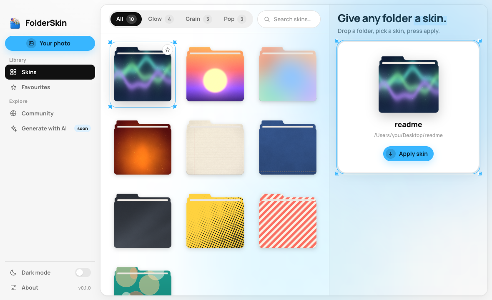
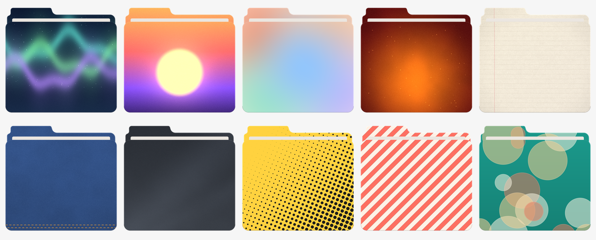

# FolderSkin

[](https://github.com/prajwal-svm/folderskin/actions/workflows/ci.yml)
[](https://github.com/prajwal-svm/folderskin/releases)
[](LICENSE)
[](#download)
[](https://tauri.app)
[](docs/PACKS.md)

Give any folder a skin.



<details><summary>Dark mode</summary>


</details>

FolderSkin turns a picture into a folder icon. Drop a folder on the window, try skins on it
and press apply: one of the ten built-in skins, a photo of your own, or a poster-style folder
an AI paints for you, with your own key or straight from Grok's or ChatGPT's chat. The icon
changes right away in Finder, Explorer or your file manager, and Revert puts the system icon
back. Everything you add is kept under **Yours**.

It's free and MIT-licensed, with no accounts, no paywall and no telemetry. It goes online
only when you ask it to: the AI assistant sends your request to the provider you picked, and
Community reads the shared packs from GitHub. The macOS app is about 10 MB installed.

## Download

Grab the installer for your platform from
[Releases](https://github.com/prajwal-svm/folderskin/releases):

| platform | file to download |
|---|---|
| macOS 12 or newer (Apple silicon and Intel) | the universal `.dmg` |
| Windows 10 and 11 | the `-setup.exe` installer, or the `.msi` |
| Debian, Ubuntu and derivatives | the `.deb` |
| any other Linux | the `.AppImage` |

The builds are not code-signed yet, so macOS needs right-click → Open the first time, and
Windows SmartScreen needs "More info" → "Run anyway". If you would rather not, build from
source — it is three commands.

## How to use it

1. Drag a folder onto the folder panel on the right, or click the empty folder to pick one.
2. Click a skin in the library to try it on; the folder panel shows the result straight away.
   The sidebar picks **All skins**, **Yours** or **Favourites**, the tags along the top narrow
   that down, and ⌘F / Ctrl+F searches.
3. Press **Apply skin**. The folder is marked **Applied**, and **Show in Finder** opens it.
4. Press **Revert** to put the operating system's default icon back.

To use your own picture, drop it on the window or press **Add your photo**. It is saved under
**Yours** and stays there until you delete it, which asks first. A finished folder on a flat
magenta background, like the ones the chat prompt below produces, is cut out and used as it is;
any other picture is wrapped onto FolderSkin's folder.

Every skin you add has a ⋯ menu: rename it, give it tags (they become filters along the top),
see how it was made (the AI model and prompt, or the pack and who shared it), share it or delete
it. AI results are tagged with their style, such as `airbrush`, as they arrive.

**Settings**, at the bottom of the sidebar, holds the theme, your AI keys, what sharing fills in
and where your skins are saved. Hover the version badge beside the logo for About.

## Community skins

People share skins and packs of skins on GitHub, free for everyone. Open **Community** to add
one: its skins join your library with their tags. To share yours, open a skin's ⋯ menu and
choose **Share with community**, or use **Community → Share your skins** for several. FolderSkin
saves a pack folder that passes the checks, and you drop it on GitHub as a pull request.
[docs/PACKS.md](docs/PACKS.md) has the contract and its limits: 1 to 24 skins a pack, pictures up
to 1024 px and 2 MB, licensed CC0, CC BY 4.0 or MIT.

## The ten built-in skins



| collection | skins |
|---|---|
| `glow` | Aurora, Sunset, Mesh, Ember |
| `grain` | Paper, Denim, Slate |
| `pop` | Halftone, Stripes, Bubbles |

All ten are original procedural art, generated by the repository's own tool from a seeded
random number generator and released under CC0. Nothing here is borrowed from another product.

## Make your own skin

A skin is a 1024 × 958 image under 400 KB. The maintainer CLI does the cropping and the
bookkeeping:

```sh
cargo run -p folderskin-tools -- skin add ~/Pictures/dunes.jpg \
  --id dunes --name Dunes --collection grain --focus 0.5,0.45
cargo run -p folderskin-tools -- skin check
pnpm tauri build          # skins are embedded at build time
```

Then look at `assets/previews/dunes.png` and adjust `--focus` until the composition is right.
[docs/SKINS.md](docs/SKINS.md) explains the safe areas — the top 12% of the image lands in the
folder's tab, the front panel keeps the middle ~85% of the height — and
[.claude/skills/folderskin-skins/SKILL.md](.claude/skills/folderskin-skins/SKILL.md) teaches
Claude Code to run the whole loop for you, so "make a skin from this photo" is a reasonable
thing to ask.

## Generate a skin with AI

FolderSkin can also make a skin from a description, using **your own API key** from a provider
you already use. The key is saved in a private file on your computer that only your account can
read (no keychain password prompts), FolderSkin has no server of its own, and nothing is sent
anywhere until you press Enter. Open **Generate with
AI**, describe a scene, pick a style, and choose **Whole folder** (the model paints the whole
folder from FolderSkin's template, like a poster) or **Just the art** (flat art wrapped onto
FolderSkin's folder). Every result is saved to **Yours** and can be tried on at once.

No key? [docs/PROMPTS.md](docs/PROMPTS.md) has a template and a prompt for Grok's or
ChatGPT's own chat; the app shows the same prompt, filled in, under **No API key?**.

[docs/AI.md](docs/AI.md) covers the providers, where the key is stored, how transparency is
handled for models that cannot return an alpha channel, and what each error message means.

## How it works

The Rust core (`crates/folderskin-core`) holds the folder template as vector paths,
cover-fits your image into the back panel and the front panel,
renders the whole thing once at 2048 px with `tiny-skia`, and downsamples to every icon size
with Lanczos3. The webview never draws folder geometry — it shows PNGs the core rendered — so
the gallery thumbnail, the preview and the icon on disk are the same pixels on every
platform. [docs/ARCHITECTURE.md](docs/ARCHITECTURE.md) has the details.

## Platform notes

| OS | mechanism | files written inside the folder | caveat |
|---|---|---|---|
| macOS | `NSWorkspace.setIcon` | the invisible `Icon\r` file macOS maintains | none; Finder updates immediately |
| Windows | `desktop.ini` + `folderskin.ico`, both hidden + system, folder marked read-only, then `SHChangeNotify` | `desktop.ini`, `folderskin.ico` | Explorer's icon cache may need `F5` |
| Linux | `.directory` for KDE, plus `gio set metadata::custom-icon` for Nautilus, Nemo and Caja | `.directory`, `.folderskin.png` | some tiling and minimal file managers read neither |

Revert removes only what FolderSkin wrote, and is safe to run twice. Cloud-synced folders
(iCloud, OneDrive, Dropbox) will sync the helper files to your other machines. The full
picture, including reverting by hand, is in [docs/PLATFORMS.md](docs/PLATFORMS.md).

## Building from source

Prerequisites on every platform: [Rust](https://rustup.rs) stable, Node 20 or newer, and
pnpm 11 or newer (`pnpm-workspace.yaml` uses the `allowBuilds` setting, which pnpm 10 ignores).

- **macOS:** Xcode command line tools (`xcode-select --install`).
- **Windows:** Visual Studio Build Tools with the C++ workload, and the WebView2 runtime
  (already present on Windows 11).
- **Linux:**

  ```sh
  sudo apt install libwebkit2gtk-4.1-dev build-essential curl wget file \
    libxdo-dev libssl-dev libayatana-appindicator3-dev librsvg2-dev
  ```

Then:

```sh
pnpm install
pnpm tauri dev      # run it
pnpm tauri build    # installers land in target/release/bundle/
```

Checks, all of which CI runs:

```sh
cargo test --workspace
pnpm test
pnpm typecheck
cargo fmt --all --check
cargo clippy --workspace --all-targets -- -D warnings
```

## Contributing

Bug reports and skins are both welcome; skins go in through [community packs](docs/PACKS.md).
[CONTRIBUTING.md](CONTRIBUTING.md) covers the
workflow and the few house rules; [SECURITY.md](SECURITY.md) is how to report a
vulnerability privately. Changes are recorded in [CHANGELOG.md](CHANGELOG.md).

## License

MIT — see [LICENSE](LICENSE). Copyright 2026 FolderSkin contributors. The bundled font is
Manrope under the SIL Open Font License (`assets/fonts/OFL.txt`); the built-in skins are CC0.
The animated icons are adapted from [lucide-animated](https://lucide-animated.com) (MIT) and
[Lucide](https://lucide.dev) (ISC); see
[src/components/icons/LICENSES.md](src/components/icons/LICENSES.md).
