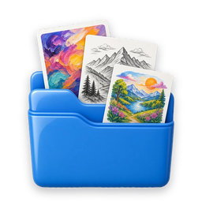
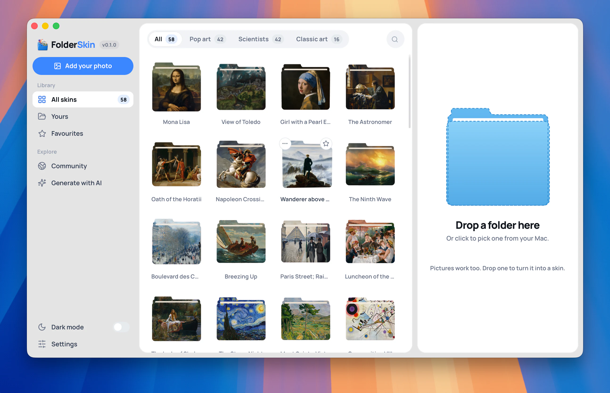
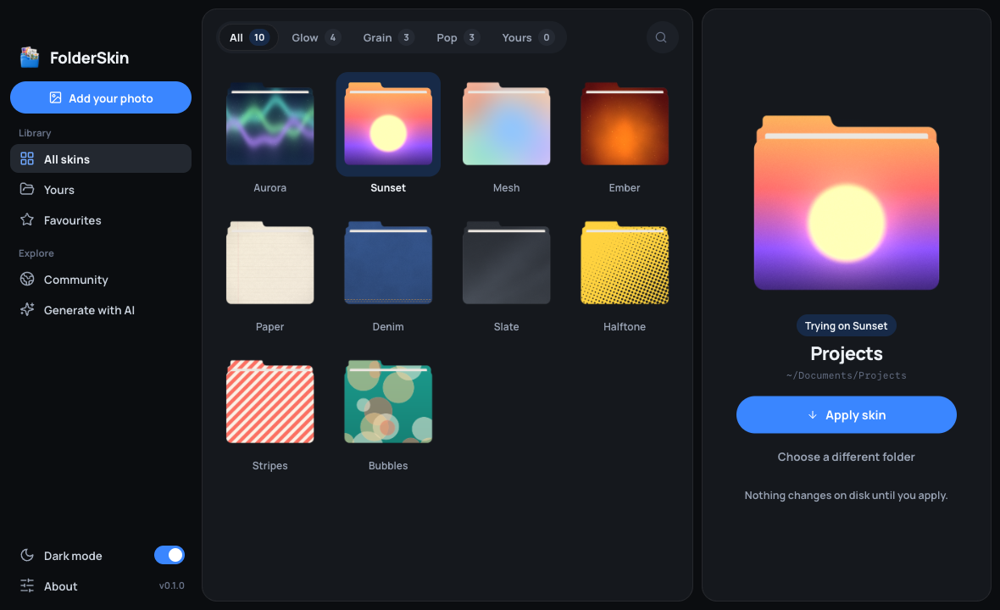
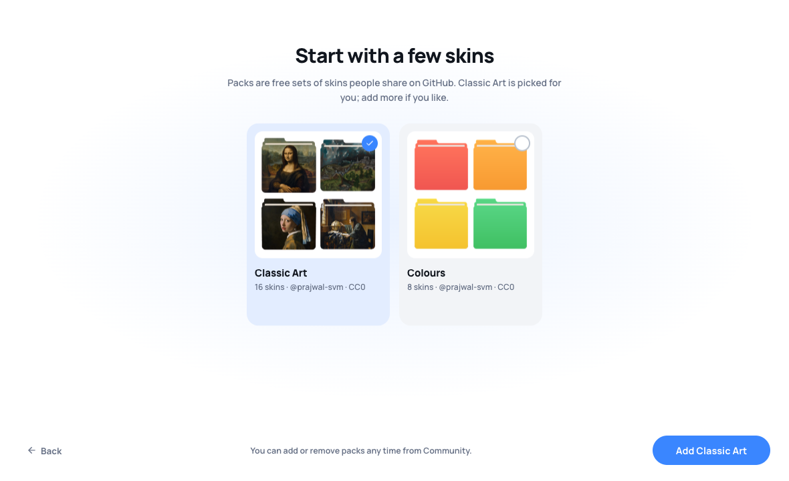
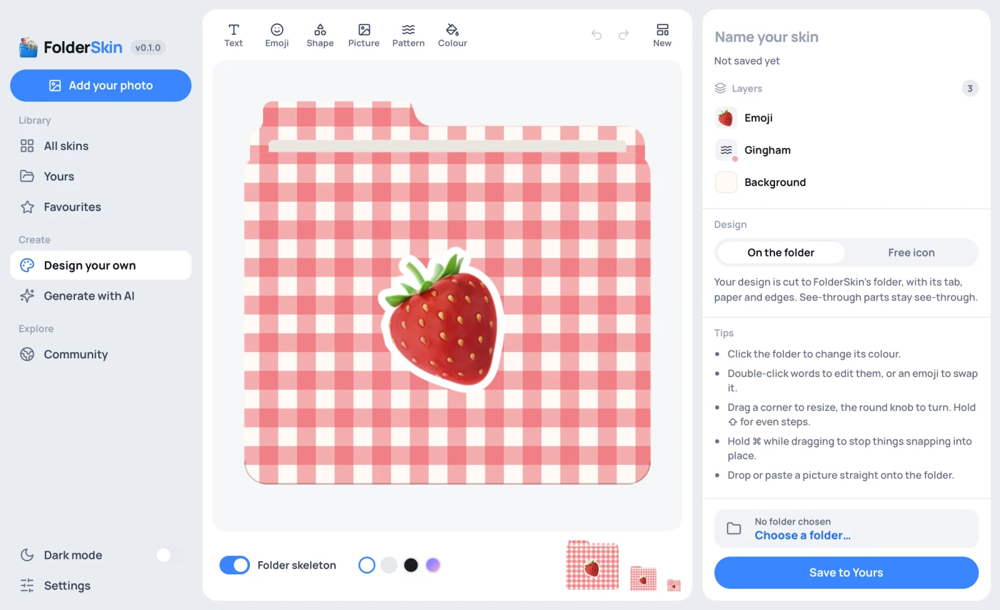

<div align="center">



# FolderSkin

[](https://github.com/prajwal-svm/folderskin/releases/latest)
[](https://github.com/prajwal-svm/folderskin/releases/latest)
[](https://github.com/prajwal-svm/folderskin/releases/latest)

[](https://github.com/prajwal-svm/folderskin/actions/workflows/ci.yml) <!-- SonarQube Cloud badges, hidden until the project exists there (docs/CI.md): [](https://sonarcloud.io/summary/new_code?id=prajwal-svm_folderskin) [](https://sonarcloud.io/component_measures?id=prajwal-svm_folderskin&metric=coverage) --> [](https://github.com/prajwal-svm/folderskin/releases) [](CHANGELOG.md) [](https://github.com/prajwal-svm/folderskin/commits/main) [](LICENSE) [](https://tauri.app) [](docs/PACKS.md) [](https://github.com/prajwal-svm/folderskin)

**Give any folder a skin.**

Your best memories wear the same plain folder as your old paperwork. FolderSkin gives every folder a
skin that feels like what's inside it: a golden-hour film still for summer photos, a vintage travel
poster for a trip, pop art for a video project, soft pastels for a birthday. Drop a folder on the
window, try skins on it, and apply the one you love. Pick from free community packs, use a photo of
your own, design one yourself from a colour, a word or an emoji, or describe any style and let AI
paint it.

<p>
  <a href="https://github.com/prajwal-svm/folderskin/releases/latest"><strong>Download free</strong></a>
  · <a href="docs/PACKS.md">Share a skin pack</a>
  · <a href="#build-from-source">Build from source</a>
  · <a href="https://github.com/prajwal-svm/folderskin">⭐ Star on GitHub</a>
</p>

Free · Open source · No account · No tracking

</div>

<div align="center">
  
</div>

<details><summary>Dark mode</summary>



</details>

## Start here

| If you want to... | Do this |
| --- | --- |
| Get your first skins | The first launch offers the community's packs, with Classic Art picked for you |
| Give a folder a new look | Drop the folder on the window, click a skin, press **Apply skin** |
| Do the folders inside it too | Turn on **Include subfolders** under the folder, then **Apply to** all of them |
| Use a photo of your own | Drop the picture on the window, or press **Add your photo** |
| Design your own | **Design your own**: start from a colour, a label, an emoji or a photo, change anything, then **Save & apply** |
| Have an AI paint one | **Generate with AI**, with your own API key, or the prompt for Grok's or ChatGPT's chat under **No API key?** |
| Get skins other people made | **Community**, then add a pack |
| Share yours | A skin's ⋯ menu → **Share with community** |
| Find a skin again | The tags along the top, ⌘F / Ctrl+F, the filter button (colour, pack, when you added it and more), or the star for **Favourites** |
| Undo it | **Revert**, or **Remove custom icon** on a folder that already has one, puts the operating system's icon back |

## What stays on your computer

Everything except the few things that need the internet. There's no account, no paywall and no
telemetry, and the macOS app is about 8.9 MB installed.

| Stays on your computer | Goes online |
| --- | --- |
| Your folders and the icons FolderSkin writes | An AI request, when you make one: sent to the provider you picked, with your key |
| Every picture you add and every skin you make | Community and the first launch, which read the shared packs from GitHub |
| Your AI keys, encrypted | The update check: when it opens, FolderSkin reads the newest release's version file from GitHub |
| Favourites, tags and settings | |

## How to use it

The first time it opens, FolderSkin plays a short welcome and then offers the community's skin
packs, with Classic Art picked for you. Add any you like or none: each pack is added whole or not
at all, and the library can always be filled later from **Community**. The welcome never shows
again.

<details><summary>The first launch</summary>



</details>

1. Drag a folder onto the folder panel on the right, or click the empty folder to pick one.
2. Click a skin in the library to try it on; the folder panel shows the result straight away.
   The sidebar picks **All skins**, **Yours** or **Favourites**, the tags along the top narrow
   that down, and ⌘F / Ctrl+F searches.
3. Press **Apply skin**. The folder is marked **Applied**, and **Show in Finder** opens it.
4. Press **Revert** to put the operating system's default icon back. A folder that already has a
   custom icon offers **Remove custom icon** as soon as you pick it.

To give the folders inside it the same skin, turn on **Include subfolders** under the folder's
name. It counts them first (all levels down, leaving out hidden folders and app bundles), and the
button becomes **Apply to 25 folders**, or however many there are. More than ten asks before it
starts. The folder panel shows each folder as it's done, **Stop** ends the run after the folder in
hand, and the summary says what changed, which folders couldn't be and why, and offers to carry on
or try those again. **Revert all** takes off exactly what the run put on.

To use your own picture, drop it on the window or press **Add your photo**. It is saved under
**Yours** and stays there until you delete it, which asks first. A finished folder on a flat
magenta background, like the ones the chat prompt below produces, is cut out and used as it is;
any other picture is wrapped onto FolderSkin's folder.

Every skin you add has a ⋯ menu: rename it (a double click on its name, or F2, jumps straight
there), give it tags (they become filters along the top),
see how it was made (the AI model and prompt, or the pack and who shared it), share it or delete
it. AI results are tagged with their style, such as `airbrush`, as they arrive.

**Settings**, at the bottom of the sidebar, holds the theme, your AI keys, what sharing fills in
and where your skins are saved. Hover the version badge beside the logo for About.

## Community skins

FolderSkin ships no skins of its own. People share skins and packs of skins on GitHub, free for
everyone; the first launch offers them, and **Community** has them any time. Adding a pack puts
its skins in your library with their tags. **Classic Art** is a good first pack: sixteen
public-domain paintings, from the Mona Lisa to The Starry Night, each painted onto a folder. To share yours, open a skin's ⋯ menu and
choose **Share with community**, or use **Community → Share your skins** for several. FolderSkin
saves a pack folder that passes the checks, and you drop it on GitHub as a pull request.
[docs/PACKS.md](docs/PACKS.md) has the contract and its limits: 1 to 50 skins a pack, pictures up
to 1024 px and 2 MB, licensed CC0, CC BY 4.0 or MIT.

## Design your own

**Design your own**, in the sidebar, makes a skin from scratch, offline. Start from a plain colour,
a label, an emoji, two tones, glass, stripes or a photo with a caption, then change all of it:

- any colour with any transparency, and gradients
- words in seventeen font styles, which can curve into an arch
- emoji, thirteen shapes, and ten patterns down to film grain
- your own pictures, with adjustments
- shadows, glows and sticker edges

The **Folder skeleton** switch shows the design on the folder or flat, and the icon beside it at
the sizes Finder draws shows how it reads. Make a see-through glass folder, or choose **Free icon**
for a sticker that isn't folder-shaped at all. **Save & apply** puts it on your folder, and
**Edit design** in its ⋯ menu opens it again. [docs/COMPOSER.md](docs/COMPOSER.md) has the
details.

<details><summary>The composer</summary>



</details>

## Generate a skin with AI

FolderSkin can make a skin from a description, using **your own API key** from a provider you
already use. The key is encrypted and stored on your computer (with no keychain password
prompts), FolderSkin has no server of its own, and nothing is sent anywhere until you press
Enter. Open **Generate with AI**, describe a scene, pick a style, and
choose **Whole folder** (the model paints the whole folder from FolderSkin's template, like a
poster) or **Just the art** (flat art wrapped onto FolderSkin's folder). Every result is saved to
**Yours** and can be tried on at once.

Paste a key into **Settings → AI keys**. Each provider's name links to the page where you make one.

| | Provider | Models | Per image |
| :-: | --- | --- | --- |
| <picture><source media="(prefers-color-scheme: dark)" srcset="docs/images/providers/openai-dark.svg"></picture> | [OpenAI](https://platform.openai.com/api-keys) | GPT Image 2.5 Flare, GPT Image 2.5 Sunburst, GPT Image 1 | ~$0.02–0.19 |
| <picture><source media="(prefers-color-scheme: dark)" srcset="docs/images/providers/xai-dark.svg"></picture> | [xAI Grok](https://console.x.ai) | Grok Imagine | ~$0.02 |
| <picture><source media="(prefers-color-scheme: dark)" srcset="docs/images/providers/recraft-dark.svg"></picture> | [Recraft](https://www.recraft.ai/profile/api) | Recraft V3 | ~$0.04 |
|  | [Google Gemini](https://aistudio.google.com/apikey) | Gemini 2.5 Flash Image | ~$0.04 |
| <picture><source media="(prefers-color-scheme: dark)" srcset="docs/images/providers/bfl-dark.svg"></picture> | [Black Forest Labs](https://dashboard.bfl.ai) | FLUX 1.1 Pro | ~$0.04 |
|  | [Stability AI](https://platform.stability.ai/account/keys) | Stable Image Core | ~3 credits |
| <picture><source media="(prefers-color-scheme: dark)" srcset="docs/images/providers/ideogram-dark.svg"></picture> | [Ideogram](https://ideogram.ai/manage-api) | Ideogram v3 | ~$0.03–0.09 |

No key? [docs/PROMPTS.md](docs/PROMPTS.md) has a template and a prompt for Grok's or
ChatGPT's own chat; the app shows the same prompt, filled in, under **No API key?**.

[docs/AI.md](docs/AI.md) covers the providers, where the key is stored, how transparency is
handled for models that cannot return an alpha channel, and what each error message means.

## Make a pack

A themed set, such as 3D folders rendered with an image model, becomes a community pack in one
command. `folderskin-tools packs make` cuts finished folders out of their magenta background
(`--flat-backdrop` for any other flat background, such as a pink drift or plain grey), shrinks
and compresses every picture to fit, and writes `pack.json`:

```sh
cargo run -p folderskin-tools -- packs make ~/Pictures/renders \
  --id 3d-folders --name "3D Folders" --tags 3d,glossy --author your-github-name \
  --preview /tmp/3d-folders.png
cargo run -p folderskin-tools -- packs check
```

`render` previews any picture as the folder it makes, and `guide` draws the template's safe
areas for artwork that gets wrapped onto the folder. [docs/PACKS.md](docs/PACKS.md) has the
contract and how a pack is proposed, [docs/SKINS.md](docs/SKINS.md) how a picture becomes an
icon, and [.claude/skills/folderskin-skins/SKILL.md](.claude/skills/folderskin-skins/SKILL.md)
teaches Claude Code to run the whole loop, so "make a pack from these renders" is a reasonable
thing to ask.

## How it works

The Rust core (`crates/folderskin-core`) holds the folder template as vector paths,
cover-fits your image into the back panel and the front panel,
renders the whole thing once at 2048 px with `tiny-skia`, and downsamples to every icon size
with Lanczos3. The webview never draws folder geometry — it shows PNGs the core rendered — so
the gallery thumbnail, the preview and the icon on disk are the same pixels on every
platform. [docs/ARCHITECTURE.md](docs/ARCHITECTURE.md) has the details.

## Platform notes

| OS | mechanism | files written inside the folder | caveat |
|---|---|---|---|
| macOS | `NSWorkspace.setIcon` | the invisible `Icon\r` file macOS maintains | none; Finder updates immediately |
| Windows | `desktop.ini` + `folderskin-<hash>.ico`, both hidden + system, folder marked read-only, then `SHChangeNotify` on the folder and its parent | `desktop.ini`, `folderskin-<hash>.ico` | none; the folder repaints as the apply finishes |
| Linux | `.directory` for KDE, plus `gio set metadata::custom-icon` for Nautilus, Nemo and Caja | `.directory`, `.folderskin.png` | some tiling and minimal file managers read neither |

Revert removes only what FolderSkin wrote, and is safe to run twice. Cloud-synced folders
(iCloud, OneDrive, Dropbox) will sync the helper files to your other machines. The full
picture, including reverting by hand, is in [docs/PLATFORMS.md](docs/PLATFORMS.md).

## Download

Free · Open source · No account · No tracking

| Platform | Package | Download |
| --- | --- | --- |
| macOS 12 or newer · Apple silicon and Intel | universal DMG | [](https://github.com/prajwal-svm/folderskin/releases/latest) |
| Windows 10 and 11 · x86_64 | `-setup.exe` or MSI | [](https://github.com/prajwal-svm/folderskin/releases/latest) |
| Linux · x86_64 | AppImage, DEB or RPM | [](https://github.com/prajwal-svm/folderskin/releases/latest) |
| Linux · ARM64 | AppImage, DEB or RPM | [](https://github.com/prajwal-svm/folderskin/releases/latest) |

The macOS app is signed and notarized by Apple, so it opens like any other. The Windows installer
isn't signed yet, so SmartScreen asks first: choose "More info", then "Run anyway". The Linux
packages need glibc 2.35 or newer (Ubuntu 22.04, Debian 12, Fedora 36 and later).

Once it's installed, FolderSkin keeps itself up to date: when a new version is out it shows what
changed, and **Update and restart** installs it. Each update is signed, and the app checks the
signature before installing anything.

## Build from source

Prerequisites on every platform: [Rust](https://rustup.rs) (rustup installs the version
`rust-toolchain.toml` names on first use), Node 22 or newer, and pnpm 11 (`packageManager` in
`package.json` names the exact version).

- **macOS:** Xcode command line tools (`xcode-select --install`).
- **Windows:** Visual Studio Build Tools with the C++ workload, and the WebView2 runtime
  (already present on Windows 11).
- **Linux:**

  ```sh
  sudo apt install libwebkit2gtk-4.1-dev build-essential curl wget file \
    libxdo-dev libssl-dev libayatana-appindicator3-dev librsvg2-dev
  ```

Then:

```sh
pnpm install
pnpm tauri dev      # run it
pnpm tauri build    # installers land in target/release/bundle/
```

Checks, all of which CI runs ([docs/CI.md](docs/CI.md) lists every job):

```sh
cargo test --workspace
pnpm test
pnpm typecheck
cargo fmt --all --check
cargo clippy --workspace --all-targets -- -D warnings
```

## Contributing

Bug reports and skins are both welcome; skins go in through [community packs](docs/PACKS.md).
[CONTRIBUTING.md](CONTRIBUTING.md) covers the workflow and the few house rules;
[SECURITY.md](SECURITY.md) is how to report a vulnerability privately. Changes are recorded in
[CHANGELOG.md](CHANGELOG.md), and [docs/RELEASING.md](docs/RELEASING.md) is how a release is
built, signed and published.

If FolderSkin gave your folders a better look, a [GitHub star](https://github.com/prajwal-svm/folderskin)
helps other people find it.

## License

MIT — see [LICENSE](LICENSE). Copyright 2026 FolderSkin contributors.

[Security](SECURITY.md) · [Contributing](CONTRIBUTING.md) · [MIT](LICENSE)

## Star history

<a href="https://www.star-history.com/#prajwal-svm/folderskin&Date">
 <picture>
   <source media="(prefers-color-scheme: dark)" srcset="https://api.star-history.com/svg?repos=prajwal-svm/folderskin&type=Date&theme=dark" />
   <source media="(prefers-color-scheme: light)" srcset="https://api.star-history.com/svg?repos=prajwal-svm/folderskin&type=Date" />
   
 </picture>
</a>
