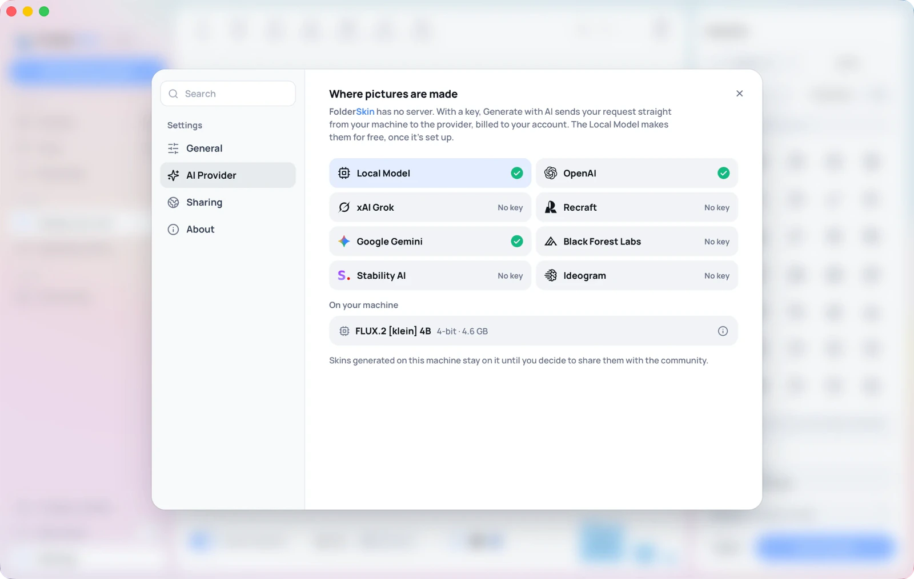

# L'assistant IA

FolderSkin peut générer un habillage à partir d'une description, de deux façons :

- **Le Modèle local** peint sur votre propre ordinateur, gratuitement. Installez-le une fois
  (FLUX.2 [klein] 4B, un téléchargement de 4,6 Go sur Mac et de 5,2 Go ailleurs), et il fonctionne
  hors ligne, sans clé et sans rien envoyer nulle part. Il tourne sur les Mac à puce Apple sous
  macOS 14 ou plus récent, et sur les PC Windows et Linux.
- **Votre propre clé** : vous collez une clé d'API d'un fournisseur chez qui vous avez déjà un
  compte, la clé est enregistrée dans un fichier privé sur votre ordinateur, et FolderSkin dialogue
  directement avec ce fournisseur depuis votre machine.

Le choix se fait dans **Réglages → Fournisseur d'IA**. Une coche indique que le Modèle local est
installé, ou qu'un fournisseur a une clé.

Il n'y a ni serveur FolderSkin, ni proxy, ni clé intégrée, ni offre gratuite à financer. Avec une
clé, rien ne part tant que vous n'avez pas cliqué sur **Générer**, et ce qui part, c'est votre
prompt, la taille choisie et l'image de référence si vous en avez choisi une (pour un dossier entier
sans image de référence, le gabarit de dossier vierge de FolderSkin).

## Où est stockée la clé

Chiffrée, dans le dossier propre à FolderSkin, lisible uniquement par votre compte utilisateur :

| | |
|---|---|
| macOS | `~/Library/Application Support/app.folderskin.desktop/keys.json` |
| Windows | `%APPDATA%\app.folderskin.desktop\keys.json` |
| Linux | `~/.config/app.folderskin.desktop/keys.json` |

Les clés sont scellées avec AES-256-GCM avant d'être écrites. La clé de chiffrement est dérivée
(HKDF-SHA256) d'un secret aléatoire stocké dans `keys.secret`, à côté de `keys.json`, et de
l'identifiant matériel de cet ordinateur. `keys.json` seul ne révèle donc rien, et les deux fichiers
copiés sur un autre ordinateur ne s'y ouvrent pas : saisissez à nouveau les clés sur le nouveau. Les
deux fichiers sont créés avec des permissions réservées au propriétaire (0600) et écrits de façon
atomique. Ce qu'aucun fichier ne peut faire, c'est tenir à l'écart un programme qui tourne déjà sous
votre compte et pourrait lire les deux. Seul le trousseau du système le pourrait, avec les demandes
de mot de passe décrites ci-dessous.

Pourquoi pas le trousseau du système : macOS lie un élément du trousseau à la signature exacte de
l'app qui l'a enregistré. Les versions open source sont généralement non signées ou signées ad hoc,
si bien que chaque recompilation ou mise à jour passerait pour une autre app et redemanderait votre
mot de passe de session. Une demande de mot de passe venant d'une app que vous venez de télécharger
ressemble exactement à ce qu'elle n'est pas. FolderSkin n'utilise donc pas du tout le trousseau.

La clé est lue au moment de la requête, n'apparaît jamais dans un message d'erreur et n'est jamais
renvoyée à la fenêtre de l'app. **Supprimer la clé**, dans la fenêtre du fournisseur, l'efface du
fichier. Supprimer `keys.json` les efface toutes.

## Les deux formes

C'est le choix qui compte le plus, et il n'a rien à voir avec la qualité.

**Juste l'image** demande au modèle une image à plat de 1024 × 958, que FolderSkin plaque sur son
propre gabarit de dossier, exactement comme une photo que vous ajoutez. La
géométrie est la nôtre, si bien que chaque habillage s'aligne sur tous les autres, à toutes les
tailles d'icônes. Tous les fournisseurs en sont capables, y compris ceux qui ne gèrent pas la
transparence. C'est le choix par défaut, et le bon dans la plupart des cas.

**Dossier entier** demande au modèle de dessiner le dossier lui-même sur un fond transparent ou sur
un fond uni à détourer, et cette image devient directement l'icône, sans passer par le compositeur.
Vous renoncez à une géométrie exacte au pixel près, et vous gagnez une illustration qui peut avoir un
vrai relief et déborder du bord supérieur du dossier.

Quand le modèle sait partir d'une image (OpenAI, Grok, Gemini) et que vous n'en avez pas joint,
FolderSkin envoie à la place son propre gabarit de dossier vierge : notre dossier, peint en gris
clair uni, centré sur un magenta uni à la taille demandée (`compositor::blank_template`). Le prompt
demande au modèle de repeindre exactement ce dossier, en gardant son contour, son onglet, sa bande de
papier, sa taille et sa position, et de laisser le magenta uni. Le résultat garde la silhouette de
FolderSkin au lieu du dossier que le modèle aurait inventé. Comme le gabarit est posé sur du magenta,
une telle génération passe toujours par le détourage décrit ci-dessous, même avec un modèle capable
de renvoyer de la transparence. Une image de référence que vous joignez vous-même sert
d'illustration, comme avant.

## La gestion de la transparence

Les modèles se répartissent en deux groupes, et FolderSkin choisit la bonne méthode selon le modèle
retenu :

- **Alpha natif.** La requête demande un fond transparent, et le PNG renvoyé en a déjà un.
  FolderSkin se contente de rogner la marge transparente.
- **Pas d'alpha.** Le prompt demande le dossier seul sur un magenta uni, `#FF00FF`. FolderSkin
  retire ensuite cette couleur, retire le magenta qui a débordé dans le bord adouci (l'étape qui
  évite qu'un détourage ait l'air entouré d'un halo rose), puis rogne. Le magenta est utilisé parce
  qu'il n'apparaît presque jamais dans les illustrations de dossiers, et parce qu'un fond manquant se
  détecte : si la bordure n'est pas magenta, c'est que le modèle a ignoré la consigne, et FolderSkin
  le signale au lieu d'appliquer une icône ratée.

Le code de détourage se trouve dans `crates/folderskin-core/src/matte.rs` et est couvert par des
tests unitaires, y compris le cas d'un sujet vraiment rose sur un fond magenta.

## Les prompts

`crates/folderskin-ai/src/prompts.rs` compose le prompt à partir de vos mots et d'un contrat. Les
parties qui font le travail relèvent de la structure plus que du style :

- **Les prompts d'illustration** interdisent de dessiner un dossier, une icône, un appareil ou une
  maquette, et réservent le huitième supérieur et une bordure de 6 % comme zones mortes, car le
  gabarit les recadre ou les courbe.
- **Les prompts de dossier entier** fixent la construction : exactement trois parties, un onglet, un
  bord de papier visible, un panneau avant, et une consigne explicite de ne pas ajouter de couches.
  Sans cette phrase, les modèles produisent à coup sûr des dossiers empilés et des onglets doublés.
- **Les prompts de gabarit** (`compose_on_template`) accompagnent le gabarit vierge : l'image jointe
  est le dossier exact à repeindre, sa forme et son cadrage restent tels quels, l'idée est peinte sur
  les panneaux arrière et avant, et le magenta reste uni.
- **Tous** se terminent par un contrat de sortie strict qui fixe la taille en pixels, l'isolement du
  sujet, et soit la couleur de détourage, soit le fond transparent.

Vous pouvez modifier ces prompts types. Ce sont de simples constantes de chaînes Rust, avec des tests
qui vérifient la présence des phrases essentielles.

## Coût

Chaque requête est facturée sur votre propre compte par votre fournisseur. La vue Générer affiche le
prix approximatif du modèle avant que vous cliquiez sur le bouton. FolderSkin fait exactement une
requête par clic, et ne réessaie jamais de lui-même.

## Compilation et compilation croisée

La couche des fournisseurs utilise `rustls` pour le TLS, dont le moteur cryptographique
(`aws-lc-sys`) compile du C. Tout se compile sans problème sur le runner de CI propre à chaque
plateforme, et c'est ainsi que sont produites les versions de FolderSkin. La compilation croisée
d'un système de bureau vers un autre (par exemple
`cargo check --target x86_64-pc-windows-msvc` sur un Mac) demande une chaîne de compilation croisée
C pour la cible, sans quoi elle échoue dans le script de build de `aws-lc-sys`. Le reste du
workspace se vérifie en compilation croisée sans cela.

## Messages d'erreur possibles

| Message | Ce qui s'est passé |
|---|---|
| « add your … API key first » | Aucune clé enregistrée pour ce fournisseur |
| « that key was rejected by … » | Le fournisseur a répondu 401 ou 403 |
| « … is rate limiting you right now » | 429 : attendez, puis réessayez |
| « the model drew a scene instead of a folder on a plain backdrop » | Mode dossier entier sans fond détourable : réessayez ou passez à Juste l'image |
| « the provider returned something that is not an image » | Une réponse mal formée, ou qui n'est pas une image |

## Dossiers créés dans un assistant conversationnel

Vous pouvez aussi peindre un dossier entier dans ChatGPT, Grok ou tout autre assistant
conversationnel, puis l'importer avec **Ajouter une photo**. Demandez le dossier sur un fond #FF00FF
uni, ou sur un fond transparent. FolderSkin reconnaît l'un comme l'autre et utilise l'image telle
quelle comme icône, détourée et rognée, au lieu de la plaquer une seconde fois sur son propre
dossier. Toute autre image est traitée comme une illustration pour le gabarit.
[ARCHITECTURE.md](../ARCHITECTURE.md#artwork-or-a-finished-folder) donne les règles exactes (en
anglais), y compris la raison pour laquelle la photo d'un objet posé sur du papier magenta reste une
image.

## Conserver un habillage généré

Chaque habillage généré est enregistré dès son arrivée, comme une image importée, avec le
fournisseur, le modèle et votre prompt. Il se trouve dans la galerie, sous Mes habillages, après un
redémarrage, et le supprimer à cet endroit l'efface du disque.
[ARCHITECTURE.md](../ARCHITECTURE.md#saved-skins) indique où se trouvent les fichiers (en anglais).
Si l'écriture échoue (un disque plein, par exemple), l'habillage reste disponible jusqu'à la fin de
la session au lieu d'être perdu.

Pour partager des habillages générés avec tout le monde, mettez-les dans un pack de la communauté :
ajoutez-leur un tag et utilisez **Partager avec la communauté** dans l'app, ou transformez un dossier
de rendus enregistrés en pack avec `folderskin-tools packs make`. [PACKS.md](PACKS.md) décrit les
deux méthodes, et [SKINS.md](SKINS.md) explique comment une image se pose sur le dossier.
