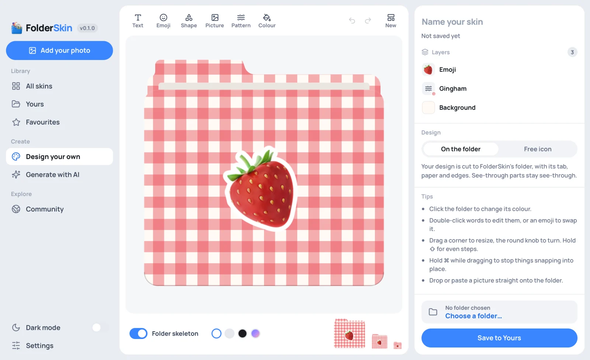

# 직접 디자인: 디자이너

사이드바의 **직접 디자인**은 스킨을 손수 만드는 캔버스예요. 색 하나만 칠한 것부터 여러 겹을 쌓은 디자인까지 만들 수 있어요. 모두 오프라인에서 동작해요. 디자인한 스킨은 다른 스킨처럼 **내 스킨**에 저장되고, **저장 후 적용**을 누르면 고른 폴더에 바로 입혀져요.



## 이런 것을 만들 수 있어요

| 만들고 싶은 것 | 시작점 | 그다음 |
| --- | --- | --- |
| 원하는 색 하나로 된 폴더 | **색상** 또는 **기본** | 폴더를 클릭하고 색을 고르세요. 색 선택기에서는 투명도까지 포함해 어떤 색이든 고를 수 있어요 |
| 라벨이 붙은 폴더: '레시피', '메모 2026' | **라벨** | 글자를 입력하고 글꼴, 굵기, 색을 고르세요. 작은 크기에서는 짧은 단어가 가장 잘 읽혀요 |
| 안에 든 것을 그림 하나로 보여 주는 폴더 | **이모지** | 이모지를 더블클릭해서 바꾸거나, 선택기에서 검색하세요('강아지', '비행기', '영수증') |
| 탭에 붙이는 라벨 | **탭 라벨** | *배치*의 **탭** 버튼을 누르면 어떤 레이어든 탭 위에 놓을 수 있어요 |
| 앞뒤 색이 다른 폴더 | **투톤** | 색이 나뉘는 경계는 종이 시트 뒤에 가려져요 |
| 속이 비치는 폴더 | **유리** 또는 **색유리** | 배경의 불투명도를 낮추거나, 배경을 지워서 투명한 폴더로 만드세요. 종이와 테두리만 남아요 |
| 무늬가 있는 폴더 | **스트라이프**, **깅엄 체크**, **물방울** | **패턴**으로 스트라이프부터 색종이 조각, 필름 그레인까지 10가지를 추가할 수 있어요 |
| 캡션이 있는 사진 | **사진** | 먼저 이미지를 고르라고 해요. 나중에 끌어다 놓거나 붙여 넣어서 더 추가할 수 있어요 |
| 스티커, 배지처럼 폴더 모양이 아닌 것 | **스티커** | *자유형 아이콘*을 고르면 디자인이 아이콘 전체가 돼요 |
| 나만의 드라이브: 외장 디스크에 '백업', USB 메모리에 사진 | **드라이브에서 시작**의 드라이브, 또는 **라벨 드라이브**, **컬러 드라이브**, **이모지 드라이브**, **사진 드라이브** | 디자인은 드라이브 앞면에 들어가요. 캔버스 아래의 메뉴로 다른 드라이브로 옮길 수 있어요 |
| 나만의 색을 입힌 드라이브: 빨간 USB 메모리, 라벨 없는 디스크 | 어떤 드라이브든 | 드라이브의 부품(케이스, 단자, 앞면)을 클릭해서 색을 입히거나, 숨기거나, 빼세요 |
| 탭 색이 다르거나 종이 시트가 없는 폴더 | 어떤 폴더든 | 폴더의 탭, 뒷면, 종이, 앞면은 레이어 목록에서 디자인 자체의 레이어 아래에 있어요 |
| 돌리거나, 옮기거나, 크기를 바꾼 폴더나 드라이브 | 어떤 폴더나 드라이브든 | 드래그하면 옮겨지고, 모서리를 드래그하면 크기가 바뀌고, 위의 조절점으로 돌릴 수 있어요. 디자인도 함께 움직여요 |
| 이미 있는 스킨에 나만의 손길 더하기 | 스킨의 ⋯ 메뉴 → **디자이너에서 리믹스** | 스킨이 이미지 레이어가 되고, 그 위에 쌓아 갈 수 있어요 |
| 전에 디자인한 것 고치기 | 그 스킨의 ⋯ 메뉴 → **디자인 편집** | **변경 사항 저장**은 그 자리에서 업데이트하고, **새로 저장**은 둘 다 남겨요 |

## 사용 방법

**시작하기**: 처음 열 때와 **새로 만들기**를 누를 때 시작점이 나와요. 모든 시작점은 평범한 디자인이라서 고정된 부분이 없어요. 저장하지 않은 변경 사항이 있을 때 다른 시작점을 고르면 먼저 물어봐요. **빈 상태로 시작**에는 빈 시작점 옆에 Mac, Windows, Linux 각자의 폴더가 있고, **드라이브에서 시작**에는 각 시스템이 보여 주는 모든 드라이브가 Mac, Windows, Linux별로 한 줄씩 있어요. 드라이브 목록은 [DRIVES.md](../DRIVES.md)(영어)에 있어요. 폴더 패널에서 드라이브를 골라 두었다면 **고른 드라이브**가 맨 앞에 나오고, 그 드라이브가 자기 이름으로 보여요. 드라이브 템플릿은 그 드라이브에서 시작하고, 고른 드라이브가 없으면 마지막 디자인의 드라이브에서, 그것도 없으면 이 시스템의 외장 디스크에서 시작해요.

**추가하기**: 폴더 위의 막대에서 **텍스트**, **이모지**, **도형**(둥근 사각형부터 말풍선까지 13가지), **이미지**(파일, 내 스킨, 또는 폴더에 끌어다 놓거나 붙여 넣은 이미지), **패턴**, **색상**(배경을 선택하고, 배경이 없으면 추가해요)을 추가할 수 있어요.

**배치하기**: 레이어를 클릭하면 선택돼요. 선택한 레이어에는 색이 살짝 입혀지고, 모서리와 변에는 조절점이, 위쪽에는 회전용 둥근 조절점이 나타나요.

- 드래그해서 옮겨요. 폴더 가운데, 탭, 폴더 가장자리, 다른 레이어에 맞춰 달라붙어요. ⌘(Ctrl)를 누른 채 옮기면 자유롭게 놓을 수 있어요.
- 모서리나 변을 드래그하면 크기가 바뀌어요. 이미지는 모서리에서 드래그하면 비율을 유지하고, 변에서 드래그하면 잘려요. 텍스트와 이모지는 항상 비율을 유지해요.
- ⇧를 누른 채 회전하면 15°씩 돌아가고, 크기를 바꾸면 도형의 비율이 유지돼요. ⌥를 누르고 있으면 가운데를 기준으로 크기가 바뀌어요.
- 글자를 더블클릭하면 편집하고, 이모지를 더블클릭하면 다른 이모지로 바꿀 수 있어요.
- 폴더 자체를 클릭하면 배경이 선택돼요. 디자인이 보이지 않는 곳을 클릭하면 클릭한 폴더나 드라이브의 부품이 선택돼요.

**레이어**: 오른쪽 위 목록에 쌓인 순서가 맨 위부터 나와요. 행을 드래그하면 순서가 바뀌고, 이름을 더블클릭하면 이름을 바꿀 수 있어요. 눈, 자물쇠, 휴지통 아이콘으로 레이어를 숨기거나, 제자리에 고정하거나, 지울 수 있어요. 제목 끝의 **모두 삭제**를 누르면 디자인이 비워져요. 그때 나오는 알림에서 되돌릴 수 있고, ⌘Z로도 되돌릴 수 있어요. 제목의 버튼은 행의 버튼처럼 마우스를 올리면 나타나요.

**폴더와 드라이브의 부품**: 레이어 목록에는 디자인의 레이어 아래에, 디자인을 입힌 폴더나 드라이브가 따로 한 그룹으로 나와요. Mac 폴더라면 **앞면**, **종이**, **뒷면**, **탭**(Windows와 Linux 폴더에는 종이가 없어요)이 나오고, 드라이브라면 그 드라이브의 부품이 나와요. 예를 들어 USB 메모리라면 **앞면**, **케이스**, **단자 구멍**, **단자**예요. 목록에서 부품을 고르거나 캔버스에서 클릭하면 그 부품이 선택되고 색이 살짝 입혀져요.

- **색상**으로 부품에 원하는 색을 입힐 수 있어요. 빛과 그림자는 그대로 남아서, 어떤 색을 고르든 빛을 받은 가장자리는 나머지보다 밝아요. **원래 색**을 누르면 부품의 원래 색으로 돌아가요. 디자인이 보이는 부품(폴더의 탭, 뒷면, 앞면과 드라이브의 앞면)에서는 이 색이 그 부품에 있는 디자인의 배경 색과 패턴을 대신하고, 글자, 이미지, 아이콘은 그 위에 그대로 있어요.
- **불투명도**를 낮추면 뒤에 있는 것이 비쳐 보이고, **아이콘에 표시**(목록의 눈 아이콘)를 끄면 부품이 숨겨져요.
- 휴지통 아이콘이나 Delete 키로 부품을 아이콘과 목록에서 뺄 수 있어요. 뺀 부품은 그룹의 행에서 되돌릴 수 있고, ⌘Z로도 되돌릴 수 있어요.

드라이브 앞면은 디자인이 인쇄된 라벨이에요. 앞면을 숨겨도 디자인은 그 자리에 남아서 드라이브 케이스 위에 보여요. 폴더는 패널 자체에 디자인이 인쇄돼 있어요. 그래서 탭을 숨기면 탭에 있던 디자인도 함께 사라져요.

폴더나 드라이브 전체를 고르면 전용 조절점이 달린 상자가 나타나요. 아무 곳이나 드래그하면 옮겨지고(처음 자리 가까이 가면 그 자리로 딱 돌아가요), 모서리를 드래그하면 크기가 바뀌고, 위의 조절점으로 돌릴 수 있어요(⇧를 누르면 15°씩). 설정의 **드라이브 전체** 또는 **폴더 전체**에는 회전과 크기, **제자리로**와 **초기화**가 있고, 화살표 키로도 조금씩 옮길 수 있어요. 그 위에 있는 것도 모두 함께 움직여요. 디자인의 레이어는 캔버스가 아니라 폴더나 드라이브 위에 놓여 있기 때문이에요.

**레이어와 설정**은 각각 제목을 눌러 열고 닫을 수 있고, 둘 사이의 막대를 드래그하면 레이어 영역을 넓히거나 좁힐 수 있어요(더블클릭하면 원래대로 돌아가고, 포커스가 있을 때는 화살표 키로도 움직여요). 마지막 상태는 이 컴퓨터에 기억돼요.

**설정**: 레이어 목록 밑에는 선택한 레이어의 설정이 모두 그 레이어 이름을 제목으로 해서 나오고, 제목에는 순서 바꾸기, 복제, 삭제 버튼이 있어요.

- 텍스트: 글꼴, 굵기, 정렬, 기울임, 대문자, 크기, 자간, 줄 높이, 곡선(아치 또는 스마일).
- 색상: 단색, 선형 그라데이션, 원형 그라데이션. 투명도를 포함해 최대 4가지 색을 쓸 수 있고, 미리 만들어 둔 그라데이션도 있어요.
- 도형: 모서리 둥글기, 꼭짓점이나 변의 수, 별의 깊이나 고리 구멍의 크기.
- 이미지: 밝기, 대비, 채도, 색조, 흐림, 흑백, 세피아, 반전, 둥근 모서리.
- 모든 레이어: 불투명도와 16가지 혼합 모드 중 하나.
- 배치한 레이어에는 그림자(네온 느낌을 내려면 **글로우로 바꾸기**)와 스티커 테두리도 있어요. 스티커 테두리는 다이컷 스티커처럼 윤곽을 따라 생기는 테두리예요.

아무것도 선택하지 않았을 때는 설정에서 **폴더에 배치**와 **자유형 아이콘** 중 하나를 골라요.

**드라이브에 디자인하기**: 드라이브에 입히는 디자인은 드라이브 앞면을 덮어요. 앞면은 드라이브의 정면, 카드의 라벨, 디스크의 가운데부터 가장자리까지를 말해요. 드라이브의 나머지 부분(받침, 커넥터, 디스크 가운데 구멍)은 앞면 둘레와 그 위에 그려지고, 디자인에서 비치는 부분으로는 드라이브 원래의 앞면이 보여요. 캔버스 아래의 스위치는 **드라이브 뼈대**로 바뀌고, 그 옆에 모든 드라이브가 있는 메뉴로 디자인을 다른 드라이브로 옮길 수 있어요. 이때 레이어는 모두 앞면에서의 자리를 지키면서 새 앞면에 맞춰져요. 새로 넣는 글자와 도형은 앞면에서 잘 읽히는 색으로 들어가요. 밝은 앞면에는 어두운 색, 색이 있는 앞면에는 흰색이에요. 글자는 앞면보다 넓어지지 않기 때문에, USB 메모리의 좁은 라벨에서는 작게 시작해요. 드라이브에는 탭이 없어서 레이어를 탭으로 옮길 수 없어요. 저장하면 드라이브에 입힌 디자인은 드라이브 스킨이 되고, 드라이브를 골라 둔 동안에는 라이브러리 맨 앞에 나와요.

**확인하기**: 캔버스 아래의 **폴더 뼈대** 스위치로 디자인을 폴더에 입힌 모습(탭, 종이 시트, 테두리 포함)과, 폴더 테두리만 겹쳐 그린 평면 모습을 오가며 볼 수 있어요. 평면 모습에서는 폴더에 가려지는 부분이 보여요. 자유형 아이콘에서는 크기를 가늠할 수 있게 뒤에 흐릿한 폴더를 보여 줘요. 그 옆의 동그라미 네 개로 디자인 뒤의 배경을 창, 밝은 데스크톱, 어두운 데스크톱, 화려한 배경 화면으로 바꿔 볼 수 있어요. 비치는 디자인이라면 이게 중요해요. 오른쪽에는 실제 크기(64, 32, 16포인트)의 아이콘이 있어서 Finder나 파일 탐색기에서 어떻게 보일지 알 수 있어요.

**저장하기**: 오른쪽 위의 이름이 스킨 이름이 돼요. 비워 두면 디자인의 첫 단어들이 이름이 돼요. **내 스킨에 저장**은 라이브러리에 보관하고, **저장 후 적용**은 고른 폴더에도 입혀요. 저장한 뒤에도 계속 열려 있어서 더 고칠 수 있어요. **변경 사항 저장**은 같은 스킨을 그 자리에서 업데이트하고, **새로 저장**은 스킨을 하나 더 추가해요. 저장하지 않은 디자인은 앱의 다른 곳을 보는 동안에도 유지되고, 저장하거나 다른 디자인으로 바꿀 때까지 이 컴퓨터에 남아 있어요.

적용할 폴더 아래의 **안에 있는 폴더 N개 포함**은 폴더 패널의 **하위 폴더 포함** 스위치와 같아요. 어느 쪽에서 켜도 둘 다 켜져요. 켜 둔 상태에서 **저장 후 적용**을 누르면 그 폴더와 안에 있는 모든 폴더에 디자인을 입히고, 10개가 넘으면 먼저 물어봐요. 버튼에 진행 상황이 나오고 옆에는 **중지**가 있으며, 끝나면 알림으로 결과를 알려 줘요. 중지한 경우에는 **계속하기**가, 일부 폴더를 바꾸지 못한 경우에는 **자세히 보기**가 나오고, 누르면 폴더 패널의 요약이 열려요. 진행 중에 디자이너를 떠나도 작업은 백그라운드에서 이어지고, 사이드바 아래쪽에 얼마나 진행됐는지 보여요.

폴더 패널의 **선택**으로 안에 있는 폴더를 골랐다면 고른 폴더만 포함되고, 스위치에도 **안에 있는 폴더 28개 중 22개 포함**처럼 나와요.

| 키 | |
| --- | --- |
| ⌘Z / ⇧⌘Z | 실행 취소, 다시 실행 |
| Delete | 선택한 레이어 삭제, 또는 선택한 폴더나 드라이브 부품 빼기 |
| ⌘D | 복제 |
| ⌘C 다음 ⌘V | 복사한 뒤 사본 붙여 넣기. 클립보드에 이미지가 있을 때 ⌘V를 누르면 그 이미지를 추가해요 |
| 화살표, ⇧ 화살표 | 선택한 레이어를 1 또는 10씩 이동. 폴더나 드라이브 전체, 또는 그 부품을 선택했을 때는 폴더나 드라이브 전체를 이동 |
| ⌘] / ⌘[ | 앞으로 가져오기, 뒤로 보내기(⌥를 함께 누르면 맨 앞으로, 맨 뒤로) |
| Esc | 선택 해제 |
| 레이어 목록에서 | ↑ ↓ 선택, ⌥↑ ⌥↓ 순서 바꾸기, F2 이름 바꾸기 |

## 작동 원리

### 아이콘 공간에 그리는 디자인

디자인은 한 변이 1024단위인 정사각형 캔버스로, 폴더 템플릿을 잴 때 쓰는 것과 같은 캔버스예요(`crates/folderskin-core/src/geometry.rs`). 어떤 지점에 놓은 것은 폴더에서도 그 지점에 있어요. 파일에서 추가한 아트워크([SKINS.md](SKINS.md))와 달리 커버 핏도 자르기도 없어요. 문서는 `src/composer/doc.ts`에 정의된 단순한 데이터이고, 바꿀 때마다 새 문서가 만들어져요. 실행 취소는 이 문서들을 거슬러 올라가는 방식이에요(`src/composer/history.ts`).

### 렌더링 경로는 여전히 하나

웹뷰는 사용자가 직접 만든 그림, 즉 텍스트, 이모지, 도형, 이미지, 패턴만 그려요(`src/composer/render.ts`). 그 주변의 폴더는 Rust 템플릿이 그려요. `composer_template`은 템플릿을 마스터 크기인 2048px로 한 번 렌더링하면서, 디자인이 사이에 끼워질 레이어들로 나눠요(`compositor::template_layers`).

```
top      the front panel's rim light and the shade along its bottom
design   masked by front: the front panel's coverage
middle   the back panel's rim light, the paper sheet and its highlight
design   masked by back: the back panel's coverage, tab included
```

스테이지는 매 프레임 이 네 개를 쌓아요(`src/composer/composite.ts`). 드래그하는 동안에도 충분히 가벼운 작업이에요. 저장되는 아이콘은 `compositor::render_master_placed`가 그려요. 같은 템플릿을 같은 헬퍼로 그리고, 두 패널을 각자 제자리에 놓인 디자인으로 채워요. `the_layers_stacked_around_a_design_are_the_saved_icon` 테스트가 둘의 차이를 채널당 3단계 이내로 유지하기 때문에, 캔버스에는 실제로 저장될 아이콘이 그대로 보여요. 다섯 번째 레이어인 `outline`은 폴더에서 보이는 테두리예요. 평면 보기에서는 여기에 색을 입혀 보여 주지만, 아이콘에는 절대 들어가지 않아요.

### 부품으로 나뉜 폴더와 드라이브

같은 템플릿은 조각으로도 나뉘어요. 조각 하나는 부품 하나이고, 쌓인 순서에서 한 자리를 차지해요. 그래서 캔버스는 부품 하나만 바꾸고 나머지는 그대로 둘 수 있어요(`src/composer/base.ts`, `composite.ts`의 `drawBase`). 각 조각은 픽셀이 있는 범위에 맞춰 잘려 있고, 자기가 무엇인지 알려 줘요.

- **surface**: 디자인이 보이는 자리예요. 흰색이고, 덮는 영역을 알파로 삼아요(폴더의 탭, 뒷면, 앞면과 드라이브의 앞면).
- **paint**: 부품 자체의 색이에요. 부품에 원하는 색을 입히면 이 부분이 바뀌어요.
- **light**: 부품 위에 드리운 빛과 그림자예요. 부품이 무슨 색이든 빛과 그림자의 색은 바뀌지 않아요.

폴더의 조각은 `compositor::template_pieces_in`에서 나와요. 뒷면 패널이 덮는 영역을 본체 윗선을 따라 잘라 탭과 뒷면으로 나누고, 가운데는 부품별로 그리고(`draw_middle_of`: 뒷면의 빛과 그림자, 앞면 패널이 드리우는 그림자, 종이), 마지막으로 앞면 패널이 덮는 영역과 그 빛을 더해요. 드라이브는 자기가 그리는 모든 것이 어느 부품에 속하는지 알려 주고(`drive/draw.rs`의 `Drawing::part`), `drive::pieces`는 앞면 아래에 있는 것도 위에 있는 것도 부품 하나씩 따로 그려요. 한 부품을 그리는 도중에 다른 부품이 끼어드는 일은 없어요. `every_drive_comes_apart_into_parts_that_stack_back_into_it`이 25가지 드라이브 모두에서 이것을 확인하고, 디자인을 사이에 두고 쌓은 조각이 저장된 드라이브와 3단계 이내로 같은지도 확인해요. 폴더는 `the_pieces_stacked_around_a_design_are_the_saved_icon`이 같은 확인을 해요. 아무것도 바꾸지 않았다면 캔버스에는 지금까지 늘 저장해 온 것과 같은 아이콘이 보여요.

색을 바꾼 부품은 그 부품의 paint를 픽셀마다 그 색으로 옮긴 거예요. 각 픽셀은 부품 원래 색의 평균에서 떨어져 있던 만큼(밝기 기준) 새 색에서 떨어지기 때문에, 빛과 그림자가 그대로 남아요. 프레임은 폴더나 드라이브의 가운데를 기준으로 쌓인 전체를 옮기고, 돌리고, 크기를 바꿔요. 스테이지는 포인터 위치를 프레임에 따라 역으로 계산하기 때문에, 디자인의 레이어는 폴더나 드라이브 위의 제자리를 지켜요.

폴더나 드라이브에서 무엇이든 바꿨다면, 아이콘을 그릴 수 있는 건 캔버스뿐이에요. 저장할 때는 아이콘 전체를 2048px로 그려 `composed: true`와 함께 보내고, `composer_save`는 그것을 완성된 폴더나 드라이브로 보관해요(캔버스 아래의 미리 보기도 같은 방식으로 그려요). 아무것도 바꾸지 않았다면 저장은 예전과 같아요.

### 저장

저장할 때는 디자인을 2048px로 한 번 더 그려 PNG로 인코딩하고, 작은 JSON 헤더 뒤에 원시 바이트로 붙여 `composer_save`로 보내요(`[u32 LE header length][header][PNG]`, `src/composer/body.ts`). 나머지는 Rust 쪽의 `src-tauri/src/composer.rs`가 처리해요.

- **폴더에 배치**: 디자인으로 폴더를 렌더링해요.
- **자유형 아이콘**: 디자인을 그대로 아이콘으로 써요. 완전히 투명한 디자인은 거절해요.
- **저장 형식**: 완성된 폴더(`kind: "folder"`, `source: "composer"`)로 저장하기 때문에, 적용, 썸네일, 공유가 다른 완성된 폴더와 똑같이 동작해요.
- **문서**: 이미지 옆에 `<stem>.design.json`으로 보관해요. **디자인 편집**은 이 파일로 디자인을 다시 열어요.
- **ID**: 디자인의 PNG, 문서, 모양으로 계산한 SHA-256이에요. 같은 디자인을 두 번 저장해도 스킨은 하나예요.
- **변경 사항 저장**: 인덱스를 한 번만 써서 옛 스킨을 바꾸고, 라이브러리에서의 위치도 유지해요. 즐겨찾기는 새 ID로 옮겨 가요.

리믹스는 `composer_skin_image`로 스킨의 원본 이미지를 읽어요.

- **아트워크**는 폴더 전체를 덮는 이미지가 돼요.
- **완성된 폴더**는 이미지를 맞춰 넣은 자유형 아이콘이 돼요. 앱이 적용할 때와 똑같은 모습이에요.

### 명령

| 명령 | 입력 | 출력 |
| --- | --- | --- |
| `composer_template` | – | `{size, back, front, middle, top, outline, parts, pieces}`: PNG 데이터 URL로 된 레이어들, 폴더 각 부분의 위치(캔버스 단위), 그리고 부품별로 나눈 폴더. 각 조각은 `{part, role, rect, src}`이고, `rect`는 템플릿의 픽셀 단위 |
| `composer_save` | 헤더 `{name, tags, shape, design, replaces, composed}`가 붙은 원시 본문 | `{skin, replaced}`: 저장된 스킨과, 그 스킨이 대신한 디자인의 ID. `composed`는 이미지가 폴더나 드라이브까지 모두 담은 아이콘 전체라는 뜻 |
| `composer_preview` | 헤더 `{shape, sizes, composed}`가 붙은 원시 본문 | 크기별 아이콘(16부터 512까지, 최대 6개)을 데이터 URL로 |
| `composer_image` | `path` | `{url, width, height, name, alpha}`: 이미지 파일. 최대 2048px이고, 투명도가 있으면 PNG, 없으면 JPEG |
| `composer_skin_image` | `skinId` | 위와 같음. 저장된 스킨의 원본 이미지 |
| `composer_design` | `skinId` | 디자인 문서. 여기서 만든 스킨이 아니면 `null` |
| `composer_drive_template` | `drive` | 드라이브의 레이어. `composer_template`과 같은 형식으로, `back`은 빈 레이어, `middle`은 아무것도 입히지 않은 드라이브, `front`는 앞면이 덮는 영역, `top`은 앞면 위에 겹치는 부분, `parts`는 앞면을 앞쪽 패널로 삼은 각 부분의 위치(디스크에서는 새 레이어가 놓일 자리인 `anchor`도 포함), 그리고 부품별로 나눈 드라이브인 `pieces` |
| `shapes` | `size` | 디자인이나 그림을 만들 수 있는 모든 모양([아래](#한-목록에-담은-모든-모양) 참고) |

### 디자인 문서

```json
{ "version": 1, "shape": "folder", "layers": [ { "kind": "fill", "paint": { "type": "solid", "color": "#3a86ff" }, "opacity": 1, "blend": "normal", "id": "…" } ] }
```

레이어는 처음부터 끝까지 순서대로 그려요.

- **캔버스 전체를 덮는 레이어**: `fill`(색이나 그라데이션)과 `pattern`.
- **배치하는 레이어**: `text`, `emoji`, `shape`, `image`. 각각 캔버스 단위의 중심 `x, y`, 도 단위의 `rotation`, 뒤집기, 선택 사항인 `shadow`와 스티커 `edge`를 가져요.
- **모든 레이어**: `opacity`, `blend`, 그리고 선택 사항인 `name`, `hidden`, `locked`.

색은 `#rrggbb`로, 비치는 색은 `#rrggbbaa`로 나타내요. 이미지는 데이터 URL로 문서 안에 보관해요. 디스크에서 읽은 문서는 먼저 `parseDoc`을 거쳐요.

- 알 수 없는 레이어는 버리고, 레이어가 64개를 넘으면 64개로 잘라요.
- 숫자는 합리적인 범위 안으로 맞추고, 색은 표준 형식으로 바꿔요.
- PNG, JPEG, WebP, GIF 데이터 URL이 아닌 이미지는 버려요.
- 더 새로운 버전에서 만든 문서는 잘못 읽는 대신 거절해요.

폴더나 드라이브에서 바꾼 내용은 `base`에 담기고, 아무것도 바꾸지 않았으면 빠져요. 부품 ID별로 적은 각 부품의 변경 사항과 프레임이 들어가요.

```json
"base": { "parts": { "case": { "color": "#e53935" }, "face": { "hidden": true }, "paper": { "removed": true, "opacity": 0.5 } },
          "frame": { "x": 0, "y": -20, "rotation": 30, "scale": 0.9 } }
```

디자인을 다른 폴더나 드라이브로 옮겨도, 옮긴 곳에 같은 부품(드라이브의 케이스, 폴더의 탭)이 있으면 그 부품의 변경 사항은 그대로 유지돼요. 부품을 지원하기 전의 FolderSkin은 부품의 변경 사항 없이 디자인을 열어요.

드라이브에 입히는 디자인에는 `"drive": "mac-external"`처럼 어느 드라이브인지 적혀 있고, 버전은 `"version": 2`예요. 그래서 드라이브를 지원하기 전의 FolderSkin은 이 디자인을 폴더에 열지 않고, 더 새로운 버전에서 만든 문서라고 알려 줘요. 폴더나 자유형 아이콘에 입히는 디자인은 예전과 똑같이 버전 1이고, 드라이브를 지원하기 전에 저장한 문서는 모두 그대로 열려요. FolderSkin이 그리지 않는 드라이브의 디자인은 폴더 디자인으로 읽어요.

### 한 목록에 담은 모든 모양

`shapes`(`src-tauri/src/bases.rs`, `folderskin_core::base::BASES`를 바탕으로 해요)는 그림을 만들 수 있는 모든 모양을 나열해요. 폴더 세 가지, 모든 드라이브, 그리고 마지막으로 폴더도 드라이브도 없는 `free`예요. 디자이너는 이 모양에서 디자인을 시작하고, AI 화면은 이 모양에 그림을 그리며, 폴더 패널에서 고른 드라이브도 이 중 하나예요. 각 항목은 버전이 바뀌어도 달라지지 않는 단순한 데이터예요.

```json
{ "id": "mac-external", "label": "Mac external drive", "system": "mac", "family": "drive",
  "whole": true, "kind": "external", "thumbnail": "data:image/png;base64,…" }
```

`id`는 폴더라면 `mac-folder`, `windows-folder`, `linux-folder` 중 하나, 드라이브라면 드라이브 자체의 ID(`mac-external`, `linux-solid-state`), 그 밖에는 `free`예요. 창은 지금 보이는 언어로 `common.shapes.<id>`에서 각 모양의 이름을, `common.shapeNotes.<id>`에서 한 줄 설명을 가져오고, 드라이브에는 시스템 이름 옆에 `common.driveNames.<id>`의 짧은 이름을 붙여요. `thumbnail`은 요청한 크기(16~512px, 정하지 않으면 96)로 그린 빈 모양이에요. 폴더는 원래 색으로, 드라이브는 앞면에 아무것도 없이 그리고, `free`에는 없어요. Rust에서는 `Base::bare(size)`가 같은 것을 그려요.

### 알아 둘 제한

- **이모지**는 시스템의 이모지 글꼴로 그려요. macOS에서는 이 글꼴이 비트맵이라 약 160px까지만 선명해요. 그래서 아주 큰 이모지는 Finder의 가장 큰 아이콘 크기에서 살짝 흐릿하지만, Finder가 평소에 보여 주는 크기에서는 모두 선명해요.
- **글꼴**은 스타일로 제공되고, 각 스타일은 macOS, Windows, Linux에 기본으로 들어 있는 글꼴을 가장 알맞은 것부터 나열한 목록이에요(`src/composer/fonts.ts`). FolderSkin에 들어 있는 글꼴은 Manrope 하나뿐이에요. **설치된 다른 글꼴**을 고르면 설치된 글꼴 패밀리를 이름으로 지정할 수 있어요. 디자인은 픽셀로 저장되기 때문에, 글꼴은 디자인을 만드는 컴퓨터에만 있으면 돼요.
- **이미지 보정**은 픽셀에 직접 적용해요(`src/composer/imagefx.ts`). macOS 12의 웹뷰에는 캔버스 필터가 없기 때문이에요. 흐림 효과는 박스 블러를 세 번 적용한 것으로, 가우시안 블러에 가까워요.
- **임시 저장본**은 웹뷰의 저장 공간에 보관하는데, 큰 이미지를 여러 장 쓴 디자인은 이 공간을 넘칠 수 있어요. 그래도 그런 임시 저장본은 앱을 종료할 때까지는 남아 있어요.

### 브라우저 미리 보기

일반 브라우저에서 `pnpm dev`를 실행해도 디자이너가 나와요. 폴더 레이어는 `docs/images/composer/`에 있는 PNG(Windows용은 `windows/`, Linux용은 `linux/`)로, `cargo run -p folderskin-tools -- composer-layers --out docs/images/composer`로 만들어요. 같은 명령이 각 드라이브의 레이어를 절반 크기로 `drives/<id>/`에 쓰고, 각 드라이브 앞면의 위치를 `drives/parts.json`에 적고, 각 폴더와 드라이브의 빈 모양을 `bases/`에 써요. 드라이브 레이어와 빈 모양은 무손실 WebP예요. 각 폴더와 드라이브의 레이어 옆에는, 조각들을 위에서 아래로 차례로 담은 `pieces.webp`와, 각 조각이 어느 부품의 것이고 어디에 놓이는지 적은 `pieces.json`이 있어요. `folderskin-tools`의 테스트가 이 파일들이 컴포지터가 그리는 픽셀과 같은지 확인하기 때문에, 오래된 상태로 남을 일이 없어요. 웹뷰 테스트 하나는 `src/composer/drives.ts`가 Rust가 그리는 각 드라이브의 앞면 자리에 요소를 놓는지도 확인해요.

### 테스트

| | |
| --- | --- |
| `folderskin-core`의 compositor | 쌓은 레이어가 저장된 아이콘과 같은지, 디자인이 그린 위치에 놓이는지, 비치는 디자인에서는 종이와 테두리만 남는지, 윤곽선이 보이는 테두리를 따라가는지. 각 폴더의 조각을 디자인을 사이에 두고 쌓으면 저장된 아이콘과 같은지, 탭이 모두 본체보다 위에 있는지 |
| `folderskin-core`의 drive | 모든 드라이브의 부품이 사이에 다른 부품을 끼우지 않고 그려지는지, 그 조각을 디자인을 사이에 두고 쌓으면 저장된 드라이브와 같은지 |
| `src-tauri`의 store | 디자인 문서가 디자인 옆에 저장되고, 다시 시작해도 남아 있고, 디자인을 지우면 함께 사라지고, 비정상 종료로 짝을 잃으면 정리되는지. 디자인에 덮어 저장해도 위치가 유지되고, 디자인이 아닌 스킨에 덮어 저장하는 건 거절하는지 |
| `src-tauri`의 composer | 본문 형식, 이미지 검사, 미리 보기, 저장, 이름 짓기, 손상된 문서, 이미지 인코딩. 그리고 Tauri 자체 IPC(모의 런타임)로 원시 바이트를 보낸 디자인을 미리 보고 저장할 수 있는지 |
| 프런트엔드(vitest) | 문서의 변경과 다시 읽기(부품의 변경 사항과 프레임 포함), 실행 취소, 이동·크기 조절·회전·맞춤, 부품의 순서와 프레임의 회전, 텍스트 레이아웃과 곡선, 도형, 색, 이미지 보정, 템플릿, 본문 형식 |
| e2e(`e2e/parts.spec.ts`) | USB 메모리의 부품이 목록에 나오고, 캔버스에서 고를 수 있고, 색을 입히고, 숨기고, 뺐다가 되돌리고, 저장할 수 있는지. USB 메모리 전체를 돌리고, 실행 취소하고, 드래그하고, 제자리로 되돌릴 수 있는지. 폴더의 종이를 빼고 탭에 색을 입히면 탭에만 색이 입혀지는지 |
